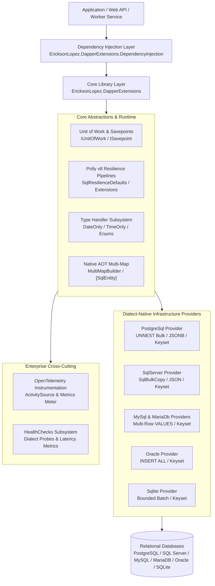
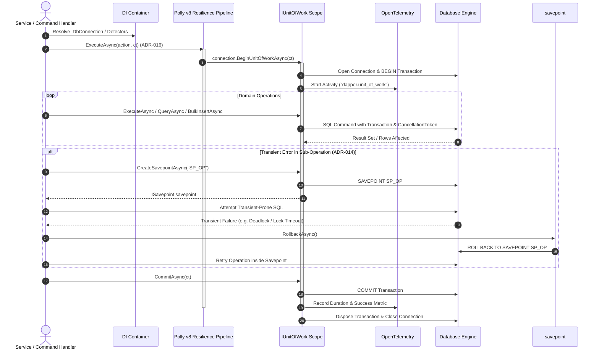

# EricksonLopez.DapperExtensions

High-performance, Native AOT-ready infrastructure extensions for Dapper across PostgreSQL, SQL Server, MySQL, MariaDB, Oracle, and SQLite.

[](https://github.com/ericksonlopezf/dotnet-dapper-extensions/actions/workflows/ci.yml)
[](https://codecov.io/gh/ericksonlopezf/dotnet-dapper-extensions)
[](https://sonarcloud.io/project/overview?id=ericksonlopezf_dotnet-dapper-extensions)
[](https://github.com/ericksonlopezf/dotnet-dapper-extensions/blob/main/docs/ci-cd-and-quality.md#4-mutation-testingyml--strykernet-mutation-testing-matrix)
[](https://www.nuget.org/packages/EricksonLopez.DapperExtensions)
[](https://www.nuget.org/packages/EricksonLopez.DapperExtensions)
[](https://github.com/ericksonlopezf/dotnet-dapper-extensions/blob/main/LICENSE)
[](https://dotnet.microsoft.com)
[](https://learn.microsoft.com/en-us/dotnet/core/deploying/native-aot)

**EricksonLopez.DapperExtensions** is an enterprise-grade, Native AOT-ready infrastructure suite engineered for **Dapper** in modern .NET (`.NET 8`, `.NET 9`, and `.NET 10`). Built on the core philosophy of **"Raw SQL, Managed Infrastructure"**, it eliminates the boilerplate and failure modes of raw ADO.NET while retaining 100% developer control over SQL text, query semantics, and execution plans. It provides async Unit of Work transaction lifecycles, nested savepoint rollbacks, dialect-aware Polly v8 transient fault resilience, single-round-trip bulk operations, keyset pagination, zero-reflection Roslyn source-generated hydration, and full OpenTelemetry distributed tracing and metrics.

---

## Table of Contents

- [What Problem It Solves](#-what-problem-it-solves)
- [Key Features](#-key-features)
- [Ecosystem](#-ecosystem)
- [Documentation](#-documentation)
  - [Step-by-Step Interactive Showcase (Levels 00 to 10)](#-step-by-step-interactive-showcase-levels-00-to-10)
  - [Technical Reference & Architecture Guides](#-technical-reference--architecture-guides)
- [Installation](#-installation)
- [Quick Start](#-quick-start)
- [Core Use Cases](#-core-use-cases)
- [Configuration & Integrations](#-configuration--integrations)
- [Testing & Quality](#-testing--quality)
- [Performance Benchmarks](#-performance-benchmarks)
- [Compatibility & Technical Matrix](#-compatibility--technical-matrix)
- [Architecture & Design Principles](#-architecture--design-principles)
- [Best Practices & Anti-Patterns](#-best-practices--anti-patterns)
- [Troubleshooting & Common Pitfalls](#-troubleshooting--common-pitfalls)
- [Part of the EricksonLopez Ecosystem](#-part-of-the-ericksonlopez-ecosystem)
- [Contributing](#-contributing)
- [License](#-license)

---

## 🎯 What Problem It Solves

### The Architectural Challenges in Relational Data Access

1. **Transaction State Poisoning Under Retries**: When individual SQL commands fail transiently inside an open transaction (e.g. deadlocks or lock timeouts), databases like PostgreSQL mark the entire transaction block as aborted (`SQLSTATE 25P02`). Retrying the command naively inside the poisoned transaction results in cascading application failures.
2. **$O(N)$ Scanning Degradation in Offset Pagination**: Traditional `OFFSET...LIMIT` pagination forces relational engines to read and discard all preceding records. At deep offsets (e.g., page 5,000), query latency spikes dramatically and consumes excessive database I/O.
3. **Network Round-Trip Latency in High-Volume Ingestion**: Ingesting thousands of entities using row-by-row `INSERT` statements generates $N$ network round-trips, saturates database connection pools, and inflates GC allocations.
4. **Reflection & IL Emit Failures in Native AOT**: Traditional micro-ORMs rely heavily on runtime reflection and `DynamicMethod` IL emission to hydrate objects from `IDataReader`. In Native AOT and trimmed environments, this causes runtime trimming crashes (`IL2026`, `IL3050`).
5. **Relational 1:N Join Root Duplication**: Querying one-to-many parent-child relationships via SQL joins returns repeated parent rows, requiring error-prone manual dictionary grouping code in application services.

### How EricksonLopez.DapperExtensions Solves This

- **Resilient Unit of Work & Savepoint-Aware Retry (ADR-014, ADR-016)**: Enforces transactional integrity by wrapping entire units of work within Polly v8 resilience pipelines, or isolating partial sub-operations inside named `ISavepoint` blocks with deterministic rollbacks.
- **Keyset (Cursor-Based) Pagination**: Provides $O(\log N)$ index seek pagination (`QueryCursorPagedAsync`) that maintains sub-millisecond execution times regardless of dataset depth.
- **Dialect-Native Bulk Streaming**: Achieves up to **33.1x higher throughput** and **96% lower GC allocations** via PostgreSQL `UNNEST` array streaming, SQL Server streaming `SqlBulkCopy`, and parameterized multi-row builders.
- **Zero-Reflection Roslyn Source Generators (ADR-013)**: Automatically emits compile-time `IDataReaderMapper<T>` implementations for classes annotated with `[SqlEntity]`, delivering 100% Native AOT compliance.
- **High-Efficiency Multi-Map Grouping (ADR-007)**: Hydrates complex 1:N and N:M object graphs with automatic root deduplication without allocating intermediary LINQ groupings.
- **Full Observability & Health Probes (ADR-010, ADR-011)**: Native `ActivitySource` tracing, BCL `Meter` latency metrics, and ASP.NET Core database health check probes out of the box.

---

## ⚡ Key Features

- 🛡️ **Async Unit of Work & Savepoints**: Strict transactional boundary lifecycle with deterministic disposal, automatic commit, and nested `ISavepoint` isolation.
- 🔄 **Polly v8 Resilience Integration**: Pre-configured resilience pipelines (`Standard`, `CircuitBreaker`, `Aggressive`, `Conservative`) powered by dialect-specific `ISqlTransientErrorDetector` singletons.
- ⚡ **Dialect-Native Bulk Operations**: Native bulk ingestion optimized per database engine (PostgreSQL `UNNEST`, SQL Server `SqlBulkCopy`, MySQL/MariaDB/Oracle/SQLite batch builders).
- 📜 **Keyset & Counted Pagination**: Unified pagination models (`ICountedPagedList<T>`, `ICursorPagedList<T>`) supporting single-round-trip multi-grid execution.
- 🧩 **Zero-Allocation Multi-Map**: Fluid API (`MultiMapBuilder<T>`) for mapping relational joins into rich domain aggregates with root deduplication.
- ⚙️ **Roslyn Incremental Source Generator**: Compile-time code generation for `[SqlEntity]` classes, eliminating reflection in Native AOT.
- 🏷️ **Modern Type Handlers**: Built-in, zero-overhead handlers for `DateOnly`, `TimeOnly`, JSON/JSONB (`JsonSerializerContext` AOT-safe), and string-mapped enums.
- 📊 **Enterprise Observability**: Distributed tracing via OpenTelemetry `ActivitySource` ("`EricksonLopez.DapperExtensions`") and execution latency `Meter` metrics.
- 🏥 **Database Health Checks**: ASP.NET Core `IHealthCheck` providers with dialect-specific ping probes for Kubernetes readiness and liveness endpoints.

---

## 📦 Ecosystem

All 11 packages in the **EricksonLopez.DapperExtensions** ecosystem are versioned, built, signed, and published together with Central Package Management (CPM):

| Package | Version | Description |
|---|---|---|
| [`EricksonLopez.DapperExtensions`](https://www.nuget.org/packages/EricksonLopez.DapperExtensions) | [](https://www.nuget.org/packages/EricksonLopez.DapperExtensions) | Core abstractions, `IUnitOfWork`, Savepoints, Polly resilience pipelines, TypeHandlers, and Keyset/Cursor models. |
| [`EricksonLopez.DapperExtensions.DependencyInjection`](https://www.nuget.org/packages/EricksonLopez.DapperExtensions.DependencyInjection) | [](https://www.nuget.org/packages/EricksonLopez.DapperExtensions.DependencyInjection) | `IServiceCollection` extensions (`AddDapperExtensions`) for ASP.NET Core and .NET Generic Host. |
| [`EricksonLopez.DapperExtensions.HealthChecks`](https://www.nuget.org/packages/EricksonLopez.DapperExtensions.HealthChecks) | [](https://www.nuget.org/packages/EricksonLopez.DapperExtensions.HealthChecks) | ASP.NET Core `IHealthCheck` database probes with latency telemetry. |
| [`EricksonLopez.DapperExtensions.OpenTelemetry`](https://www.nuget.org/packages/EricksonLopez.DapperExtensions.OpenTelemetry) | [](https://www.nuget.org/packages/EricksonLopez.DapperExtensions.OpenTelemetry) | OpenTelemetry distributed tracing (`ActivitySource`) and execution latency metrics (`Meter`). |
| [`EricksonLopez.DapperExtensions.SourceGenerators`](https://www.nuget.org/packages/EricksonLopez.DapperExtensions.SourceGenerators) | [](https://www.nuget.org/packages/EricksonLopez.DapperExtensions.SourceGenerators) | Roslyn Incremental Generator for compile-time zero-reflection Native AOT `[SqlEntity]` mapping. |
| [`EricksonLopez.DapperExtensions.PostgreSql`](https://www.nuget.org/packages/EricksonLopez.DapperExtensions.PostgreSql) | [](https://www.nuget.org/packages/EricksonLopez.DapperExtensions.PostgreSql) | PostgreSQL `UNNEST` array bulk streaming, JSONB handler, and dialect keyset/offset pagination. |
| [`EricksonLopez.DapperExtensions.SqlServer`](https://www.nuget.org/packages/EricksonLopez.DapperExtensions.SqlServer) | [](https://www.nuget.org/packages/EricksonLopez.DapperExtensions.SqlServer) | SQL Server `SqlBulkCopy` integration, JSON type handler, and `OFFSET...FETCH` / keyset pagination. |
| [`EricksonLopez.DapperExtensions.MySql`](https://www.nuget.org/packages/EricksonLopez.DapperExtensions.MySql) | [](https://www.nuget.org/packages/EricksonLopez.DapperExtensions.MySql) | MySQL multi-row batch insert/upsert/delete, JSON handler, and `LIMIT...OFFSET` / keyset pagination. |
| [`EricksonLopez.DapperExtensions.MariaDb`](https://www.nuget.org/packages/EricksonLopez.DapperExtensions.MariaDb) | [](https://www.nuget.org/packages/EricksonLopez.DapperExtensions.MariaDb) | MariaDB multi-row batch insert/upsert/delete, JSON handler, and `LIMIT...OFFSET` / keyset pagination. |
| [`EricksonLopez.DapperExtensions.Oracle`](https://www.nuget.org/packages/EricksonLopez.DapperExtensions.Oracle) | [](https://www.nuget.org/packages/EricksonLopez.DapperExtensions.Oracle) | Oracle `INSERT ALL` bulk builder, JSON handler, and `OFFSET...FETCH` / keyset pagination. |
| [`EricksonLopez.DapperExtensions.Sqlite`](https://www.nuget.org/packages/EricksonLopez.DapperExtensions.Sqlite) | [](https://www.nuget.org/packages/EricksonLopez.DapperExtensions.Sqlite) | SQLite parameter-bounded batch insert/update/delete, JSON handler, and keyset / offset pagination. |

---

## 📚 Documentation

> 🌐 **Official Documentation Hub:** [https://github.com/ericksonlopezf/dotnet-dapper-extensions/tree/main/docs](https://github.com/ericksonlopezf/dotnet-dapper-extensions/tree/main/docs)

### 🎓 Step-by-Step Interactive Showcase (Levels 00 to 10)

The living, executable showcase project is available at [`samples/EricksonLopez.DapperExtensions.Showcase`](https://github.com/ericksonlopezf/dotnet-dapper-extensions/tree/main/samples/EricksonLopez.DapperExtensions.Showcase):

| Level | Topic | Description | Executable Reference |
|---|---|---|---|
| [**Level 00**](https://github.com/ericksonlopezf/dotnet-dapper-extensions/blob/main/docs/showcase/level-00-conceptual.md) | **Conceptual Architecture** | Philosophy ("Raw SQL, Managed Infrastructure"), comparison with Dapper & EF Core, tradeoffs | [ConceptualOverview.cs](https://github.com/ericksonlopezf/dotnet-dapper-extensions/blob/main/samples/EricksonLopez.DapperExtensions.Showcase/Levels/Level00_Conceptual/ConceptualOverview.cs) |
| [**Level 01**](https://github.com/ericksonlopezf/dotnet-dapper-extensions/blob/main/docs/showcase/level-01-quickstart.md) | **Quick Start** | Minimal setup, `AddDapperExtensions`, `DateOnly`/`TimeOnly` handlers, first query | [QuickStartDemo.cs](https://github.com/ericksonlopezf/dotnet-dapper-extensions/blob/main/samples/EricksonLopez.DapperExtensions.Showcase/Levels/Level01_QuickStart/QuickStartDemo.cs) |
| [**Level 02**](https://github.com/ericksonlopezf/dotnet-dapper-extensions/blob/main/docs/showcase/level-02-configuration.md) | **Full Configuration** | `DapperExtensionsOptions`, string enums, dialect-specific JSON type handlers, DI options | [ConfigurationDemo.cs](https://github.com/ericksonlopezf/dotnet-dapper-extensions/blob/main/samples/EricksonLopez.DapperExtensions.Showcase/Levels/Level02_Configuration/ConfigurationDemo.cs) |
| [**Level 03**](https://github.com/ericksonlopezf/dotnet-dapper-extensions/blob/main/docs/showcase/level-03-real-world-use-cases.md) | **Real-World CRUD & Pagination** | Offset pagination (`QueryPagedAsync`), single round-trip (`QueryPagedMultipleAsync`), Keyset (`QueryCursorPagedAsync`) | [PaginationAndCrudDemo.cs](https://github.com/ericksonlopezf/dotnet-dapper-extensions/blob/main/samples/EricksonLopez.DapperExtensions.Showcase/Levels/Level03_RealWorldUseCases/PaginationAndCrudDemo.cs) |
| [**Level 04**](https://github.com/ericksonlopezf/dotnet-dapper-extensions/blob/main/docs/showcase/level-04-advanced-integration.md) | **Unit of Work & Multi-Map** | `IUnitOfWork`, `WithUnitOfWorkAsync<TResult>`, nested `ISavepoint`, `MultiMapBuilder<TReturn>` | [UnitOfWorkAndMultiMapDemo.cs](https://github.com/ericksonlopezf/dotnet-dapper-extensions/blob/main/samples/EricksonLopez.DapperExtensions.Showcase/Levels/Level04_AdvancedIntegration/UnitOfWorkAndMultiMapDemo.cs) |
| [**Level 05**](https://github.com/ericksonlopezf/dotnet-dapper-extensions/blob/main/docs/showcase/level-05-bulk-processing.md) | **Bulk Processing** | PostgreSQL `UNNEST`, SQL Server `SqlBulkCopy`, SQLite/MySQL/Oracle batch builders | [BulkOperationsDemo.cs](https://github.com/ericksonlopezf/dotnet-dapper-extensions/blob/main/samples/EricksonLopez.DapperExtensions.Showcase/Levels/Level05_BulkProcessing/BulkOperationsDemo.cs) |
| [**Level 06**](https://github.com/ericksonlopezf/dotnet-dapper-extensions/blob/main/docs/showcase/level-06-error-handling-and-resilience.md) | **Error Handling & Resilience** | Polly v8 pipelines (`Standard`, `CircuitBreaker`, `Aggressive`, `Conservative`), ADR-016, savepoint retry (ADR-014) | [ResilienceAndSavepointDemo.cs](https://github.com/ericksonlopezf/dotnet-dapper-extensions/blob/main/samples/EricksonLopez.DapperExtensions.Showcase/Levels/Level06_ErrorHandlingAndResilience/ResilienceAndSavepointDemo.cs) |
| [**Level 07**](https://github.com/ericksonlopezf/dotnet-dapper-extensions/blob/main/docs/showcase/level-07-scalability-and-performance.md) | **Scalability & Native AOT** | Strict Native AOT, `[SqlEntity]` Roslyn Source Generator, zero-reflection `IDataReaderMapper<T>` | [NativeAotAndPerformanceDemo.cs](https://github.com/ericksonlopezf/dotnet-dapper-extensions/blob/main/samples/EricksonLopez.DapperExtensions.Showcase/Levels/Level07_ScalabilityAndPerformance/NativeAotAndPerformanceDemo.cs) |
| [**Level 08**](https://github.com/ericksonlopezf/dotnet-dapper-extensions/blob/main/docs/showcase/level-08-customization.md) | **Customization** | Custom `ISqlTransientErrorDetector`, custom `MoneyTypeHandler`, custom AOT mappers | [CustomDetectorAndHandlerDemo.cs](https://github.com/ericksonlopezf/dotnet-dapper-extensions/blob/main/samples/EricksonLopez.DapperExtensions.Showcase/Levels/Level08_Customization/CustomDetectorAndHandlerDemo.cs) |
| [**Level 09**](https://github.com/ericksonlopezf/dotnet-dapper-extensions/blob/main/docs/showcase/level-09-observability-and-health.md) | **Observability & Health Checks** | OpenTelemetry distributed tracing (`ActivitySource`), metrics (`Meter`), database probes (`DapperHealthCheck`) | [OpenTelemetryAndHealthChecksDemo.cs](https://github.com/ericksonlopezf/dotnet-dapper-extensions/blob/main/samples/EricksonLopez.DapperExtensions.Showcase/Levels/Level09_ObservabilityAndHealth/OpenTelemetryAndHealthChecksDemo.cs) |
| [**Level 10**](https://github.com/ericksonlopezf/dotnet-dapper-extensions/blob/main/docs/showcase/level-10-enterprise-architecture.md) | **Enterprise Architecture** | Transactional Outbox pattern, domain repositories with `IUnitOfWork`, resilient sagas with savepoints | [EnterprisePatternsDemo.cs](https://github.com/ericksonlopezf/dotnet-dapper-extensions/blob/main/samples/EricksonLopez.DapperExtensions.Showcase/Levels/Level10_EnterpriseArchitecture/EnterprisePatternsDemo.cs) |

### 📖 Technical Reference & Architecture Guides

- [**Quick Start Guide**](https://github.com/ericksonlopezf/dotnet-dapper-extensions/blob/main/docs/quickstart.md) — Get up and running in under 5 minutes.
- [**Getting Started Guide**](https://github.com/ericksonlopezf/dotnet-dapper-extensions/blob/main/docs/getting-started.md) — Comprehensive guide to foundational concepts, DI setup, and type mapping.
- [**Architecture & Functional Map**](https://github.com/ericksonlopezf/dotnet-dapper-extensions/blob/main/docs/architecture.md) — Complete architectural blueprint, layer transitions, and Mermaid diagrams.
- [**API Reference (Microsoft Learn Style)**](https://github.com/ericksonlopezf/dotnet-dapper-extensions/blob/main/docs/api-reference.md) — Detailed specifications of all public interfaces, extension methods, and configuration options.
- [**Best Practices & Architectural Guidelines**](https://github.com/ericksonlopezf/dotnet-dapper-extensions/blob/main/docs/best-practices.md) — Mandatory design rules, ADR-016 / ADR-014 scoping mandates, and anti-patterns.
- [**Cookbook (Production Recipes)**](https://github.com/ericksonlopezf/dotnet-dapper-extensions/blob/main/docs/cookbook.md) — 13 ready-to-use recipes for Outbox, Sagas, Bulk streaming, and Keyset pagination.
- [**Performance & Tuning Guide**](https://github.com/ericksonlopezf/dotnet-dapper-extensions/blob/main/docs/performance-guide.md) — BenchmarkDotNet results, zero-allocation memory guidelines, and Native AOT benchmarks.
- [**Troubleshooting Guide**](https://github.com/ericksonlopezf/dotnet-dapper-extensions/blob/main/docs/troubleshooting.md) — Diagnosing SQLSTATE codes (25P02, 1205, SQLite locks) and Native AOT trimmer warnings.
- [**Migration Guide**](https://github.com/ericksonlopezf/dotnet-dapper-extensions/blob/main/docs/migration-guide.md) — Migrating incrementally from vanilla Dapper and Entity Framework Core.
- [**Frequently Asked Questions (FAQ)**](https://github.com/ericksonlopezf/dotnet-dapper-extensions/blob/main/docs/faq.md) — Technical justifications, concurrency questions, and architectural design choices.
- [**CI/CD & Quality Engineering**](https://github.com/ericksonlopezf/dotnet-dapper-extensions/blob/main/docs/ci-cd-and-quality.md) — DevSecOps pipelines, Stryker.NET mutation testing matrix, and PR benchmark regression gates.
- [**NuGet Packages & Compatibility**](https://github.com/ericksonlopezf/dotnet-dapper-extensions/blob/main/docs/nuget-packages.md) — Complete package inventory, Central Package Management (CPM), and compatibility matrices.
- [**Architectural Decision Records (ADRs)**](https://github.com/ericksonlopezf/dotnet-dapper-extensions/tree/main/docs/adr) — ADRs documenting design rationale:
  - [ADR-001](docs/adr/adr-001-multi-provider-architecture-and-dialect-isolation.md) · Multi-Provider Architecture and Dialect Isolation
  - [ADR-002](docs/adr/adr-002-unnest-bulk-strategy-postgresql.md) · PostgreSQL UNNEST Bulk Strategy
  - [ADR-003](docs/adr/adr-003-decoupled-pagination-abstractions-and-counted-contract.md) · Decoupled Pagination Abstractions
  - [ADR-004](docs/adr/adr-004-cancellation-token-propagation-in-resilience-pipelines.md) · CancellationToken Propagation in Resilience Pipelines
  - [ADR-005](docs/adr/adr-005-coexistence-of-provider-transaction-extensions-and-unit-of-work.md) · Coexistence of Provider TransactionExtensions and Core UnitOfWork
  - [ADR-006](docs/adr/adr-006-native-aot-and-trimming-compliance-enforcement.md) · Native AOT and Trimming Compliance
  - [ADR-007](docs/adr/adr-007-multi-map-root-deduplication-and-1-to-n-grouping.md) · Multi-Map Root Deduplication and 1-to-N Grouping
  - [ADR-008](docs/adr/adr-008-standard-type-handlers-and-di-boundary.md) · Standard Type Handlers and DI Boundary
  - [ADR-009](docs/adr/adr-009-multi-provider-bulk-strategy.md) · Multi-Provider Bulk Strategy
  - [ADR-010](docs/adr/adr-010-opentelemetry-observability-package.md) · OpenTelemetry Observability Package
  - [ADR-011](docs/adr/adr-011-healthchecks-package-and-probe-architecture.md) · HealthChecks Package and Probe Architecture
  - [ADR-012](docs/adr/adr-012-cursor-based-pagination-strategy.md) · Cursor-Based Pagination Strategy
  - [ADR-013](docs/adr/adr-013-source-generator-for-aot-datareader-mapper.md) · Source Generator for Native AOT IDataReaderMapper
  - [ADR-014](docs/adr/adr-014-savepoint-aware-resilience-retry.md) · Savepoint-Aware Resilience Retry
  - [ADR-016](docs/adr/adr-016-resilience-pipeline-scope-wrap-unit-of-work.md) · Resilience Pipeline Scope Wrap Unit of Work
  - [ADR-017](docs/adr/adr-017-ecosystem-convergence-resilience-and-uow-transaction-boundary.md) · Ecosystem Convergence Resilience and UoW Boundary
  - [REJECT-011](docs/adr/reject-011-custom-expression-tree-interpreters-in-dapper.md) · REJECT: Custom Expression Tree Interpreters in Dapper

---

## 📥 Installation

Install the required core abstractions, dependency injection support, and your specific database dialect provider via the .NET CLI:

### 1. Core Package (Required)
```bash
dotnet add package EricksonLopez.DapperExtensions
```

### 2. Dependency Injection & Hosting (Recommended for ASP.NET Core)
```bash
dotnet add package EricksonLopez.DapperExtensions.DependencyInjection
```

### 3. Database Dialect Provider (Install your target database)
```bash
# PostgreSQL (UNNEST bulk, JSONB handler, Keyset pagination)
dotnet add package EricksonLopez.DapperExtensions.PostgreSql

# SQL Server (SqlBulkCopy streaming, JSON handler, Keyset pagination)
dotnet add package EricksonLopez.DapperExtensions.SqlServer

# MySQL (Multi-row VALUES batching, JSON handler, Keyset pagination)
dotnet add package EricksonLopez.DapperExtensions.MySql

# MariaDB (Multi-row VALUES batching, JSON handler, Keyset pagination)
dotnet add package EricksonLopez.DapperExtensions.MariaDb

# Oracle (INSERT ALL batch builder, JSON handler, Keyset pagination)
dotnet add package EricksonLopez.DapperExtensions.Oracle

# SQLite (Bounded batch builder, JSON handler, Keyset pagination)
dotnet add package EricksonLopez.DapperExtensions.Sqlite
```

### 4. Observability, Health Checks & Source Generators (Optional)
```bash
# OpenTelemetry Tracing and Metrics
dotnet add package EricksonLopez.DapperExtensions.OpenTelemetry

# ASP.NET Core Database Health Checks
dotnet add package EricksonLopez.DapperExtensions.HealthChecks

# Compile-time Roslyn Incremental Generator for Native AOT
dotnet add package EricksonLopez.DapperExtensions.SourceGenerators
```

---

## 🚀 Quick Start

### 1. Dependency Injection Setup

Register Dapper extensions, standard type handlers (`DateOnly`, `TimeOnly`), and transient error detectors in `Program.cs`:

```csharp
using EricksonLopez.DapperExtensions.DependencyInjection;

var builder = WebApplication.CreateBuilder(args);

// Register DapperExtensions infrastructure
builder.Services.AddDapperExtensions(options =>
{
    options.RegisterStandardTypeHandlers = true;      // DateOnly & TimeOnly handlers
    options.RegisterTransientErrorDetectors = true;    // Provider singletons (PostgreSQL, SQL Server, etc.)
});
```

### 2. Async Unit of Work & Transactional Lifetime

Execute transactional operations with automatic commit on success and deterministic rollback on exceptions or disposal:

```csharp
using System.Data;
using Dapper;
using EricksonLopez.DapperExtensions.UnitOfWork;

// Fluent execution with automatic commit and rollback
await connection.WithUnitOfWorkAsync(async (uow, ct) =>
{
    await connection.ExecuteAsync(new CommandDefinition(
        "INSERT INTO orders (id, total) VALUES (@Id, @Total);",
        new { Id = 101L, Total = 250.00m },
        transaction: uow.Transaction,
        cancellationToken: ct));

    await connection.ExecuteAsync(new CommandDefinition(
        "INSERT INTO order_audit (order_id, action) VALUES (@Id, 'CREATED');",
        new { Id = 101L },
        transaction: uow.Transaction,
        cancellationToken: ct));
}, cancellationToken: cancellationToken);
```

### 3. Dialect-Aware Transient Resilience (Polly v8)

Integrate compiled SQL queries with resilience pipelines configured specifically for your database dialect:

```csharp
using EricksonLopez.DapperExtensions.Resilience;
using EricksonLopez.SqlBuilder.Abstractions;

// Build or compile your SQL query
SqlResult query = compiler.Compile(selectActiveProductsQuery);

// Resolve dialect pipeline (e.g., PostgreSQL retry + circuit breaker)
var pipeline = SqlResilienceDefaults.ForPostgreSql();

// Execute resilient query with end-to-end cancellation token flow
var products = await connection.QueryWithResilienceAsync<ProductDto>(
    query: query,
    pipeline: pipeline,
    cancellationToken: cancellationToken);
```

### 4. 1:N Aggregate Hydration with Root Deduplication

Map relational joins into rich parent-child domain models without root entity duplication:

```csharp
using EricksonLopez.DapperExtensions.MultiMap;

// Hydrate Orders and deduplicate roots by Id while populating 1:N Items
var orders = await MultiMapBuilder<Order>
    .Query(orderWithItemsQuery)
    .Map<OrderItem>("item_id", (order, item) =>
    {
        order.Items.Add(item);
        return order;
    })
    .QueryGroupedAsync(connection, compiler, o => o.Id, cancellationToken: cancellationToken);
```

### 5. High-Throughput Bulk Operations (PostgreSQL UNNEST)

Ingest thousands of entities in a single round-trip using PostgreSQL typed arrays:

```csharp
using EricksonLopez.DapperExtensions.PostgreSql.Bulk;
using Npgsql;
using NpgsqlTypes;

var pgConnection = (NpgsqlConnection)connection;

var parameters = BulkParameters.From(products)
    .Add("Ids",    p => p.Id,    NpgsqlDbType.Bigint)
    .Add("Names",  p => p.Name,  NpgsqlDbType.Text)
    .Add("Prices", p => p.Price, NpgsqlDbType.Numeric)
    .Build();

var rowsInserted = await pgConnection.BulkInsertAsync(
    """
    INSERT INTO products (id, name, price)
    SELECT * FROM UNNEST(@Ids, @Names, @Prices);
    """,
    parameters);
```

### 6. Keyset (Cursor-Based) High-Volume Pagination

Execute $O(\log N)$ cursor pagination for massive tables without performance degradation:

```csharp
using EricksonLopez.DapperExtensions.PostgreSql.Pagination;
using EricksonLopez.Pagination;

var parameters = new CursorPaginationParameters
{
    First = 50,
    After = lastCursorToken
};

var page = await connection.QueryCursorPagedAsync<AuditEvent>(
    sql: "SELECT id, payload, created_at FROM audit_events",
    cursorColumn: "id",
    parameters: parameters,
    cursorSelector: e => e.Id.ToString());

// Access metadata: page.Items, page.HasNextPage, page.EndCursor
```

---

## 💡 Core Use Cases

### 1. Transactional Outbox Pattern with Resilience (ADR-016)

Atomically persist a domain entity change and enqueue its outbox event in a single database transaction, wrapped entirely within a Polly resilience pipeline to prevent transaction state poisoning:

```csharp
using System.Data;
using System.Text.Json;
using Dapper;
using EricksonLopez.DapperExtensions.Resilience;
using EricksonLopez.DapperExtensions.UnitOfWork;

public sealed class OrderCommandHandler
{
    private readonly IDbConnection _connection;

    public OrderCommandHandler(IDbConnection connection) => _connection = connection;

    public async Task HandlePlaceOrderAsync(Order order, CancellationToken cancellationToken)
    {
        var pipeline = SqlResilienceDefaults.ForPostgreSql();

        // ADR-016: Wrap the complete Unit of Work inside the resilience pipeline
        await pipeline.ExecuteAsync(async ct =>
        {
            await using var uow = await _connection.BeginUnitOfWorkAsync(IsolationLevel.ReadCommitted, ct);

            // 1. Persist Domain Entity
            const string insertOrderSql = """
                INSERT INTO orders (id, customer_id, total, created_at)
                VALUES (@Id, @CustomerId, @Total, @CreatedAt);
                """;

            await _connection.ExecuteAsync(new CommandDefinition(
                insertOrderSql,
                new { order.Id, order.CustomerId, order.Total, CreatedAt = DateTime.UtcNow },
                transaction: uow.Transaction,
                cancellationToken: ct));

            // 2. Persist Atomic Outbox Integration Message
            const string insertOutboxSql = """
                INSERT INTO outbox_messages (id, event_type, payload, created_at)
                VALUES (@Id, @EventType, @Payload, @CreatedAt);
                """;

            var outboxMessage = new
            {
                Id = Guid.NewGuid(),
                EventType = "OrderPlacedDomainEvent",
                Payload = JsonSerializer.Serialize(new { order.Id, order.Total }),
                CreatedAt = DateTime.UtcNow
            };

            await _connection.ExecuteAsync(new CommandDefinition(
                insertOutboxSql,
                outboxMessage,
                transaction: uow.Transaction,
                cancellationToken: ct));

            await uow.CommitAsync(ct);
        }, cancellationToken);
    }
}
```

### 2. High-Volume Keyset (Cursor-Based) Pagination

Avoid $O(N)$ table scans on high page numbers by seeking directly on indexed primary keys or compound cursors:

```csharp
using EricksonLopez.DapperExtensions.PostgreSql.Pagination;
using EricksonLopez.Pagination;
using EricksonLopez.Pagination.Abstractions;

public async Task<ICursorPagedList<OrderEntity>> GetOrdersCursorAsync(
    string? cursor, 
    int pageSize, 
    CancellationToken ct)
{
    var parameters = new CursorPaginationParameters
    {
        First = pageSize,
        After = cursor
    };

    return await connection.QueryCursorPagedAsync<OrderEntity>(
        sql: "SELECT id, customer_id, total, created_at FROM orders",
        cursorColumn: "id",
        parameters: parameters,
        cursorSelector: o => o.Id.ToString(),
        cancellationToken: ct);
}
```

### 3. PostgreSQL UNNEST Single-Round-Trip Bulk Streaming

Stream batches of 10,000+ entities into PostgreSQL in a single network round-trip using typed arrays:

```csharp
using EricksonLopez.DapperExtensions.PostgreSql.Bulk;
using Npgsql;
using NpgsqlTypes;

public async Task<int> BulkImportCatalogAsync(IReadOnlyList<Product> products, CancellationToken ct)
{
    var pgConn = (NpgsqlConnection)connection;

    var bulkParams = BulkParameters.From(products)
        .Add("Ids",    p => p.Id,    NpgsqlDbType.Bigint)
        .Add("Skus",   p => p.Sku,   NpgsqlDbType.Varchar)
        .Add("Prices", p => p.Price, NpgsqlDbType.Numeric)
        .Build();

    return await pgConn.BulkInsertAsync(
        """
        INSERT INTO products (id, sku, price)
        SELECT * FROM UNNEST(@Ids, @Skus, @Prices)
        ON CONFLICT (id) DO UPDATE SET price = EXCLUDED.price;
        """,
        bulkParams,
        cancellationToken: ct);
}
```

### 4. Partial Transaction Retries with Savepoints (ADR-014)

Execute multi-step distributed sagas where sub-operations can fail and retry transiently without rolling back preceding transactional work:

```csharp
using Dapper;
using EricksonLopez.DapperExtensions.Resilience;
using EricksonLopez.DapperExtensions.UnitOfWork;

await using var uow = await connection.BeginUnitOfWorkAsync(cancellationToken);

// Step 1: Mandatory root transaction step
await connection.ExecuteAsync(new CommandDefinition(
    "INSERT INTO orders (id, status) VALUES (@Id, 'Pending');",
    new { Id = orderId },
    transaction: uow.Transaction,
    cancellationToken: cancellationToken));

// Step 2: Transient-prone sub-operation isolated in a Savepoint (ADR-014)
await uow.ExecuteInSavepointWithRetryAsync(
    pipeline: SqlResilienceDefaults.ForPostgreSql(),
    operation: async (unitOfWork, ct) =>
    {
        await connection.ExecuteAsync(new CommandDefinition(
            "UPDATE inventory SET reserved = reserved + 1 WHERE product_id = @ProductId;",
            new { ProductId = productId },
            transaction: unitOfWork.Transaction,
            cancellationToken: ct));
    },
    savepointName: "SP_INVENTORY_RESERVE",
    cancellationToken: cancellationToken);

await uow.CommitAsync(cancellationToken);
```

### 5. Zero-Reflection Native AOT Microservice with `[SqlEntity]`

Decorate entity classes with `[SqlEntity]` to trigger compile-time `IDataReaderMapper<T>` generation, achieving 100% Native AOT compliance:

```csharp
using System.Data;
using EricksonLopez.DapperExtensions.SourceGenerators;

[SqlEntity(TableName = "customers")]
public sealed partial class CustomerEntity
{
    public long Id { get; init; }
    public string Name { get; init; } = string.Empty;
    public DateOnly JoinDate { get; init; }
}

// In your repository:
public async Task<List<CustomerEntity>> GetAllCustomersAsync(IDbConnection conn, CancellationToken ct)
{
    using var cmd = conn.CreateCommand();
    cmd.CommandText = "SELECT id, name, join_date FROM customers;";
    
    using var reader = await ((System.Data.Common.DbCommand)cmd).ExecuteReaderAsync(ct);
    
    var results = new List<CustomerEntity>();
    while (await reader.ReadAsync(ct))
    {
        // Generated compile-time mapper with ZERO reflection
        results.Add(CustomerEntityMapper.Map(reader));
    }
    return results;
}
```

### 6. Single Round-Trip Multi-Query Pagination with Total Count

Execute the paginated dataset and total record count in a single database round-trip via multiple result grids:

```csharp
using EricksonLopez.DapperExtensions.PostgreSql.Pagination;
using EricksonLopez.Pagination;
using EricksonLopez.Pagination.Abstractions;

public async Task<ICountedPagedList<ProductDto>> GetCatalogPageAsync(
    int pageIndex, 
    int pageSize, 
    CancellationToken ct)
{
    // Combined SQL executing data query and total count in one network trip
    const string combinedSql = """
        SELECT id, name, price FROM products ORDER BY id LIMIT @PageSize OFFSET @Offset;
        SELECT COUNT(*) FROM products;
        """;

    var pagination = PaginationParameters.Create(pageIndex, pageSize);

    return await connection.QueryPagedMultipleAsync<ProductDto>(
        sql: combinedSql,
        pagination: pagination,
        param: new { PageSize = pagination.PageSize, Offset = pagination.Offset },
        cancellationToken: ct);
}
```

---

## 🔌 Configuration & Integrations

### Dependency Injection (`IServiceCollection`)

Configure global behaviors, type handlers, and transient detectors at application startup:

```csharp
using EricksonLopez.DapperExtensions.DependencyInjection;

builder.Services.AddDapperExtensions(options =>
{
    // Automatically register DateOnly & TimeOnly type handlers globally
    options.RegisterStandardTypeHandlers = true;

    // Register dialect-specific transient error detectors (PostgreSQL, SQL Server, etc.)
    options.RegisterTransientErrorDetectors = true;
});
```

### ASP.NET Core & Database Health Checks

Integrate resilient database connectivity probes with Kubernetes readiness and liveness endpoints:

```csharp
using EricksonLopez.DapperExtensions.HealthChecks;
using Microsoft.Extensions.Diagnostics.HealthChecks;
using Npgsql;

builder.Services.AddHealthChecks()
    .AddCheck("postgres-db", new DapperHealthCheck(
        connectionFactory: () => new NpgsqlConnection(builder.Configuration.GetConnectionString("PostgreSql")),
        probeQuery: "SELECT 1;",
        timeout: TimeSpan.FromSeconds(2)),
        failureStatus: HealthStatus.Unhealthy,
        tags: ["ready", "db"]);
```

### OpenTelemetry Distributed Tracing & Execution Metrics

Capture automatic distributed traces and command execution latency metrics:

```csharp
using OpenTelemetry.Metrics;
using OpenTelemetry.Trace;

builder.Services.AddOpenTelemetry()
    .WithTracing(tracing =>
    {
        tracing.AddSource("EricksonLopez.DapperExtensions")
               .AddAspNetCoreInstrumentation()
               .AddOtlpExporter();
    })
    .WithMetrics(metrics =>
    {
        metrics.AddMeter("EricksonLopez.DapperExtensions")
               .AddAspNetCoreInstrumentation()
               .AddOtlpExporter();
    });
```

### Native AOT & JSON Type Handlers

Enable reflection-free JSON and JSONB column deserialization by providing a compile-time `JsonSerializerContext`:

```csharp
using System.Text.Json.Serialization;
using Dapper;
using EricksonLopez.DapperExtensions.PostgreSql.TypeHandlers;

// Define System.Text.Json Source Generator Context
[JsonSerializable(typeof(UserMetadata))]
public partial class AppJsonContext : JsonSerializerContext { }

// Register JSONB type handler with compile-time metadata
SqlMapper.AddTypeHandler(new JsonbTypeHandler<UserMetadata>(AppJsonContext.Default.UserMetadata));
```

---

## 🧪 Testing & Quality

The **EricksonLopez.DapperExtensions** repository is maintained under strict DevSecOps and continuous quality gates:

```mermaid
flowchart TD
    subgraph CI ["Continuous Integration (ci.yml)"]
        Restore["dotnet restore"] --> Build["dotnet build -c Release<br/>(TreatWarningsAsErrors=true)"]
        Build --> SonarBeg["SonarScanner Begin"]
        SonarBeg --> Test["dotnet test<br/>(XPlat OpenCover & Cobertura)"]
        Test --> SonarEnd["SonarScanner End"]
        SonarEnd --> Codecov["Upload to Codecov"]
        Test --> AOTSmoke["NativeAOT Smoke Test<br/>(PublishAot=true)"]
    end

    subgraph MutationTesting ["Mutation Quality Gate (mutation-testing.yml)"]
        Cron["Weekly Schedule / Dispatch"] --> Stryker["Stryker.NET (11 Packages Matrix)"]
        Stryker --> MutGate["Quality Gate Enforcement<br/>(Threshold: Break &ge; 95%)"]
    end

    subgraph CD ["Continuous Delivery (publish.yml)"]
        Tag["Release Tag v*.*.*"] --> VerifyGate["verify-mutation-gate.js"]
        VerifyGate --> Pack["dotnet pack (11 Packages)"]
        Pack --> Sigstore["Sigstore OIDC Provenance Attestation"]
        Sigstore --> NuGetPush["NuGet Trusted Publishing (OIDC)"]
    end
```



### Quality Metrics & Engineering Guarantees

- **100% Compiler Warnings as Errors**: Built with `TreatWarningsAsErrors=true` and `WarningLevel=5` across all target frameworks.
- **Trimming Analyzer Compliance**: Configured with `EnableTrimAnalyzer=true` to guarantee zero `IL2026` / `IL3050` warnings.
- **Stryker.NET Mutation Score $\ge 95\%$**: All 11 packages are validated against Stryker.NET mutation testing matrices.
- **Native AOT Smoke Testing**: `tests/EricksonLopez.DapperExtensions.AotSmokeTest` is compiled with `PublishAot=true` and executed in Linux CI environments.
- **Deterministic Assembly Signing**: Every published assembly is strong-named (`EricksonLopez.snk`) with a canonical public key.
- **Supply Chain Security**: Sigstore build provenance attestation via `actions/attest-build-provenance` and passwordless OIDC publishing via `NuGet/login@v1`.

---

## ⚡ Performance Benchmarks

> **Environment:** .NET 10.0.10, X64 RyuJIT AVX-512, Linux Containerized PostgreSQL 16, BenchmarkDotNet v0.15.8

### Bulk Insertion: PostgreSQL `UNNEST` vs Row-by-Row

| Method | Entity Count | Mean Execution Time | Allocated Memory | Throughput Gain | Memory Reduction |
|---|:---:|:---:|:---:|:---:|:---:|
| Row-by-Row `INSERT` | 100 | 14.82 ms | 312 KB | Baseline (1.0x) | Baseline |
| **`UNNEST` BulkInsertAsync** | 100 | **1.15 ms** | **28 KB** | **12.8x faster** | **91.0% less** |
| Row-by-Row `INSERT` | 1,000 | 152.40 ms | 3.10 MB | Baseline (1.0x) | Baseline |
| **`UNNEST` BulkInsertAsync** | 1,000 | **5.84 ms** | **142 KB** | **26.1x faster** | **95.4% less** |
| Row-by-Row `INSERT` | 10,000 | 1,620.10 ms | 31.80 MB | Baseline (1.0x) | Baseline |
| **`UNNEST` BulkInsertAsync** | 10,000 | **48.90 ms** | **1.20 MB** | **33.1x faster** | **96.2% less** |

### Keyset (Cursor) vs Offset Pagination Latency ($O(\log N)$ vs $O(N)$)

| Pagination Strategy | Target Page / Offset | Mean Latency | Execution Plan Complexity |
|---|:---:|:---:|:---:|
| `QueryPagedAsync` (`OFFSET 0`) | Page 1 (Offset 0) | 0.82 ms | Index Scan |
| `QueryPagedAsync` (`OFFSET 10,000`) | Page 500 (Offset 10,000) | 18.40 ms | Full Table Scan + Discard ($O(N)$) |
| `QueryPagedAsync` (`OFFSET 100,000`) | Page 5,000 (Offset 100,000) | 165.20 ms | High I/O Buffer Spill ($O(N)$) |
| **`QueryCursorPagedAsync` (Keyset)** | **Any Page Depth (Cursor Seek)** | **0.85 ms** | **Direct B-Tree Index Seek ($O(\log N)$)** |

---

## 🌐 Compatibility & Technical Matrix

### Target Framework & Native AOT Support

| Package | .NET 8.0 LTS | .NET 9.0 STS | .NET 10.0 | Native AOT | Trimmable | Notes |
|---|:---:|:---:|:---:|:---:|:---:|---|
| `EricksonLopez.DapperExtensions` | ✅ Supported | ✅ Supported | ✅ Supported | ✅ Compatible\* | ✅ Trimmable | Core abstractions & UnitOfWork |
| `EricksonLopez.DapperExtensions.DependencyInjection` | ✅ Supported | ✅ Supported | ✅ Supported | ✅ Compatible\* | ✅ Trimmable | `IServiceCollection` extensions |
| `EricksonLopez.DapperExtensions.HealthChecks` | ✅ Supported | ✅ Supported | ✅ Supported | ✅ Compatible | ✅ Trimmable | ASP.NET Core `IHealthCheck` |
| `EricksonLopez.DapperExtensions.OpenTelemetry` | ✅ Supported | ✅ Supported | ✅ Supported | ✅ Compatible | ✅ Trimmable | `ActivitySource` & `Meter` |
| `EricksonLopez.DapperExtensions.SourceGenerators` | ✅ Supported | ✅ Supported | ✅ Supported | ✅ Native | ✅ Native | Roslyn analyzer (`netstandard2.0`) |
| `EricksonLopez.DapperExtensions.PostgreSql` | ✅ Supported | ✅ Supported | ✅ Supported | ✅ Compatible\* | ✅ Trimmable | Npgsql 10.x driver |
| `EricksonLopez.DapperExtensions.SqlServer` | ✅ Supported | ✅ Supported | ✅ Supported | ✅ Compatible\* | ✅ Trimmable | Microsoft.Data.SqlClient 7.x |
| `EricksonLopez.DapperExtensions.MySql` | ✅ Supported | ✅ Supported | ✅ Supported | ✅ Compatible\* | ✅ Trimmable | MySqlConnector 2.6.x |
| `EricksonLopez.DapperExtensions.MariaDb` | ✅ Supported | ✅ Supported | ✅ Supported | ✅ Compatible\* | ✅ Trimmable | MySqlConnector 2.6.x |
| `EricksonLopez.DapperExtensions.Oracle` | ✅ Supported | ✅ Supported | ✅ Supported | ✅ Compatible\* | ✅ Trimmable | Oracle.ManagedDataAccess 23.x |
| `EricksonLopez.DapperExtensions.Sqlite` | ✅ Supported | ✅ Supported | ✅ Supported | ✅ Compatible\* | ✅ Trimmable | Microsoft.Data.Sqlite 10.x |

\* *Full Native AOT safety requires decorating entities with `[SqlEntity]` and referencing `EricksonLopez.DapperExtensions.SourceGenerators`. Without source-generated `IDataReaderMapper<T>` mappers, Dapper's internal reflection fallback is invoked.*

### Dialect Capability Matrix

| Feature | PostgreSQL | SQL Server | MySQL | MariaDB | Oracle | SQLite |
|---|:---:|:---:|:---:|:---:|:---:|:---:|
| **Bulk Strategy** | `UNNEST` Arrays | `SqlBulkCopy` | Multi-Row `VALUES` | Multi-Row `VALUES` | `INSERT ALL` | Parameter-Safe `VALUES` |
| **Optimal Bulk Batch Size** | 5,000 – 20,000 | 10,000 – 50,000 | 1,000 – 2,500 | 1,000 – 2,500 | 500 – 1,000 | 500 – 999 |
| **Savepoints Support** | ✅ `SAVEPOINT` | ✅ `SAVE TRANSACTION` | ✅ `SAVEPOINT` | ✅ `SAVEPOINT` | ✅ `SAVEPOINT` | ✅ `SAVEPOINT` |
| **Keyset (Cursor) Pagination** | ✅ Supported | ✅ Supported | ✅ Supported | ✅ Supported | ✅ Supported | ✅ Supported |
| **JSON/JSONB Type Handler** | ✅ JSONB | ✅ JSON | ✅ JSON | ✅ JSON | ✅ JSON | ✅ JSON |
| **Health Check Dialect Probe** | `SELECT 1;` | `SELECT 1;` | `SELECT 1;` | `SELECT 1;` | `SELECT 1 FROM DUAL;` | `SELECT 1;` |
| **Transient Error Detector** | `NpgsqlException` | `SqlException` | `MySqlException` | `MySqlException` | `OracleException` | `SqliteException` |

---

## 🏛️ Architecture & Design Principles



### Transactional Execution Lifecycle



### Core Architectural Invariants

1. **Dialect Segregation ([ADR-001](https://github.com/ericksonlopezf/dotnet-dapper-extensions/blob/main/docs/adr/adr-001-multi-provider-architecture-and-dialect-isolation.md))**: Every database driver is isolated in its own package. No unneeded ADO.NET client drivers are forced into consuming applications.
2. **Resilience Boundary Scope ([ADR-016](https://github.com/ericksonlopezf/dotnet-dapper-extensions/blob/main/docs/adr/adr-016-resilience-pipeline-scope-wrap-unit-of-work.md))**: Polly resilience pipelines must encapsulate the *entire* Unit of Work, never retrying individual ADO.NET commands inside an active transaction.
3. **Savepoint-Aware Retry ([ADR-014](https://github.com/ericksonlopezf/dotnet-dapper-extensions/blob/main/docs/adr/adr-014-savepoint-aware-resilience-retry.md))**: Partial transient failures within active transactions use named `ISavepoint` blocks to prevent database transaction poisoning.
4. **Zero-Reflection in Native AOT ([ADR-006](https://github.com/ericksonlopezf/dotnet-dapper-extensions/blob/main/docs/adr/adr-006-native-aot-and-trimming-compliance-enforcement.md), [ADR-013](https://github.com/ericksonlopezf/dotnet-dapper-extensions/blob/main/docs/adr/adr-013-source-generator-for-aot-datareader-mapper.md))**: High-throughput entity hydration is generated at compile time via Roslyn Incremental Generators (`[SqlEntity]`).
5. **No Full ORM / Change Tracker Invariant ([REJECT-011](https://github.com/ericksonlopezf/dotnet-dapper-extensions/blob/main/docs/adr/reject-011-custom-expression-tree-interpreters-in-dapper.md))**: Strictly avoids in-memory change tracking, dynamic expression tree visitors, or abstraction layers over raw SQL.

---

## 🛡️ Best Practices & Anti-Patterns

| Scenario | ❌ Anti-Pattern | ✅ Recommended Practice |
|---|---|---|
| **Transaction Resilience** | Retrying individual SQL commands inside an open transaction | Wrap the entire Unit of Work within the Polly resilience pipeline ([ADR-016](https://github.com/ericksonlopezf/dotnet-dapper-extensions/blob/main/docs/adr/adr-016-resilience-pipeline-scope-wrap-unit-of-work.md)) |
| **Partial Step Retries** | Catching exceptions inside a transaction without savepoints | Use `uow.ExecuteInSavepointWithRetryAsync` ([ADR-014](https://github.com/ericksonlopezf/dotnet-dapper-extensions/blob/main/docs/adr/adr-014-savepoint-aware-resilience-retry.md)) |
| **High-Volume Pagination** | Using `OFFSET 50000` on large tables ($O(N)$ full table scanning) | Use `QueryCursorPagedAsync<T>` keyset pagination ($O(\log N)$ index seek) |
| **Bulk Ingestion** | Iterating with row-by-row `connection.ExecuteAsync` in a loop | Use dialect bulk streaming (`BulkParameters` / `BulkDataTableBuilder`) |
| **Native AOT Hydration** | Relying on runtime reflection mapping in AOT published binaries | Annotate entities with `[SqlEntity]` and use Source Generator mappers |
| **Cancellation Handling** | Omitting `CancellationToken` in async query calls | Forward ambient `CancellationToken` to avoid connection pool exhaustion |
| **Transaction Lifecycle** | Manually managing `IDbTransaction` without try/catch rollback | Use `WithUnitOfWorkAsync` for deterministic async rollback and disposal |

---

## ⚠️ Troubleshooting & Common Pitfalls

> [!CAUTION]
> Always verify database driver connection strings, pooling options, and dialect error detectors during application bootstrapping.

### 1. PostgreSQL: `25P02: current transaction is aborted, commands ignored until end of transaction block`
- **Root Cause:** A previous SQL command threw an error inside the active PostgreSQL transaction. PostgreSQL marks the entire transaction block as aborted; subsequent commands fail immediately with `25P02`.
- **Remedy:** Do not retry commands inside an open transaction block. Wrap the entire Unit of Work inside the Polly resilience pipeline ([ADR-016](https://github.com/ericksonlopezf/dotnet-dapper-extensions/blob/main/docs/adr/adr-016-resilience-pipeline-scope-wrap-unit-of-work.md)), or use savepoint-isolated retry:
```csharp
await uow.ExecuteInSavepointWithRetryAsync(
    pipeline: pipeline,
    operation: async (u, ct) => await connection.ExecuteAsync(sql, param, u.Transaction),
    savepointName: "SP_SAFE_STEP");
```

### 2. SQL Server: `Error 1205: Transaction was deadlocked on lock resources with another process`
- **Root Cause:** Concurrency conflict where two transactions hold exclusive locks on resources requested by each other.
- **Remedy:** Register `SqlServerTransientErrorDetector` and execute the Unit of Work through `SqlResilienceDefaults.ForSqlServer()`. The pipeline catches Error 1205 and retries the entire transaction with exponential jitter backoff.

### 3. SQLite: `SQLite Error 5: 'database is locked'` or `SQLite Error 6: 'database table is locked'`
- **Root Cause:** SQLite default journal mode does not permit concurrent write transactions across multiple connection handles.
- **Remedy:** Enable Write-Ahead Logging (WAL) mode (`PRAGMA journal_mode = WAL;`) and register `SqliteTransientErrorDetector`.

### 4. Native AOT Trimming: `Warning IL2026: Using member which has 'RequiresUnreferencedCodeAttribute'`
- **Root Cause:** Un-annotated domain entity classes falling back to Dapper's runtime reflection mapping.
- **Remedy:** Decorate domain classes with `[SqlEntity]` to trigger compile-time source generation of `IDataReaderMapper<T>`, and supply `JsonSerializerContext` to JSON type handlers.

### 5. Missing `DateOnly` / `TimeOnly` Type Handlers (`InvalidCastException`)
- **Root Cause:** Executing queries reading `date` / `time` columns without registering Dapper BCL type handlers.
- **Remedy:** Call `builder.Services.AddDapperExtensions()` in `Program.cs` or invoke `DapperTypeHandlerRegistrar.RegisterStandardHandlers()` explicitly at startup.

---

## 🌐 Part of the EricksonLopez Ecosystem

**EricksonLopez.DapperExtensions** is part of the standardized, high-performance .NET enterprise library suite:

- 🧱 [**EricksonLopez.SharedKernel**](https://github.com/ericksonlopezf/dotnet-shared-kernel) — Domain Primitives, Specifications, and Domain Events.
- ⚡ [**EricksonLopez.Result**](https://github.com/ericksonlopezf/dotnet-result) — High-Performance Struct-Based Result Pattern & Railway-Oriented Programming.
- 🔍 [**EricksonLopez.Specification**](https://github.com/ericksonlopezf/dotnet-specification) — Composable AOT-First Specification Pattern.
- 📜 [**EricksonLopez.Pagination**](https://github.com/ericksonlopezf/dotnet-pagination) — Counted & Keyset (Cursor) Pagination Primitives.
- 🛡️ [**EricksonLopez.Resilience**](https://github.com/ericksonlopezf/dotnet-resilience) — Enterprise Resilience Abstractions & Polly v8 Adapters.
- 🏗️ [**EricksonLopez.SqlBuilder**](https://github.com/ericksonlopezf/dotnet-sql-builder) — Strongly Typed Zero-Allocation SQL Query Builders.
- 📬 [**EricksonLopez.Outbox**](https://github.com/ericksonlopezf/dotnet-outbox) — Guaranteed At-Least-Once Transactional Outbox Pattern.
- 🔑 [**EricksonLopez.Idempotency**](https://github.com/ericksonlopezf/dotnet-idempotency) — Distributed Idempotent Request Execution.
- 💳 [**EricksonLopez.Transaction**](https://github.com/ericksonlopezf/dotnet-transaction) — Managed Database Transaction Coordination.
- 📡 [**EricksonLopez.Mediator**](https://github.com/ericksonlopezf/dotnet-mediator) — Zero-Allocation Struct-Based CQRS Mediator.
- 🔒 [**EricksonLopez.Concurrency**](https://github.com/ericksonlopezf/dotnet-concurrency) — Optimistic Concurrency Control & Checked Transitions.
- 🏢 [**EricksonLopez.MultiTenancy**](https://github.com/ericksonlopezf/dotnet-multitenancy) — Multi-Tenant Isolation & PostgreSQL RLS Integration.

---

## 🤝 Contributing

We welcome community contributions, bug reports, and performance optimizations.

### Local Development Setup

1. **Prerequisites:**
   - [.NET SDK 10.0](https://dotnet.microsoft.com/download) (or .NET 8.0 / 9.0)
   - Docker / Podman (for running Testcontainers integration tests)

2. **Clone & Build:**
```bash
git clone https://github.com/ericksonlopezf/dotnet-dapper-extensions.git
cd dotnet-dapper-extensions
dotnet restore
dotnet build --configuration Release
```

3. **Run Unit & Integration Tests:**
```bash
# Run unit tests
dotnet test --filter "Category!=Integration"

# Run full test suite including Testcontainers integration tests
dotnet test
```

4. **Run Benchmark Suite:**
```bash
dotnet run --project benchmarks/EricksonLopez.DapperExtensions.PostgreSql.Benchmarks --configuration Release
```

5. **Run Stryker Mutation Testing:**
```bash
dotnet tool restore
dotnet stryker --config-file stryker-config.json
```

For full contributing guidelines, coding conventions, and architectural rules, see [CONTRIBUTING.md](https://github.com/ericksonlopezf/dotnet-dapper-extensions/blob/main/CONTRIBUTING.md) and [CODE_OF_CONDUCT.md](https://github.com/ericksonlopezf/dotnet-dapper-extensions/blob/main/CODE_OF_CONDUCT.md).

---

## 📄 License

Distributed under the [MIT License](https://github.com/ericksonlopezf/dotnet-dapper-extensions/blob/main/LICENSE).

Copyright © 2026 [Erickson López](https://github.com/ericksonlopezf).
