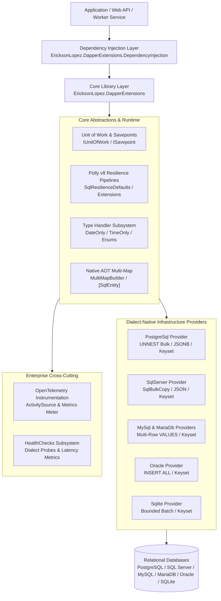
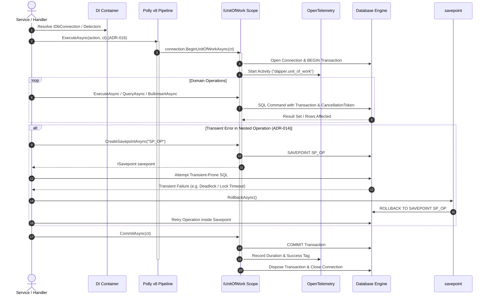
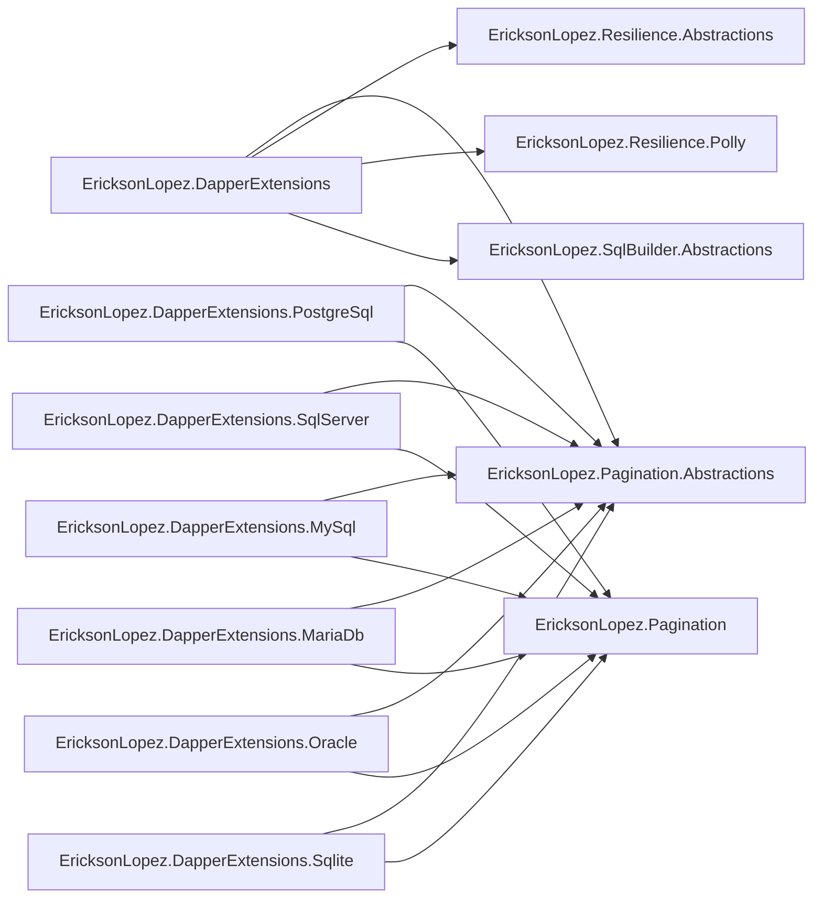
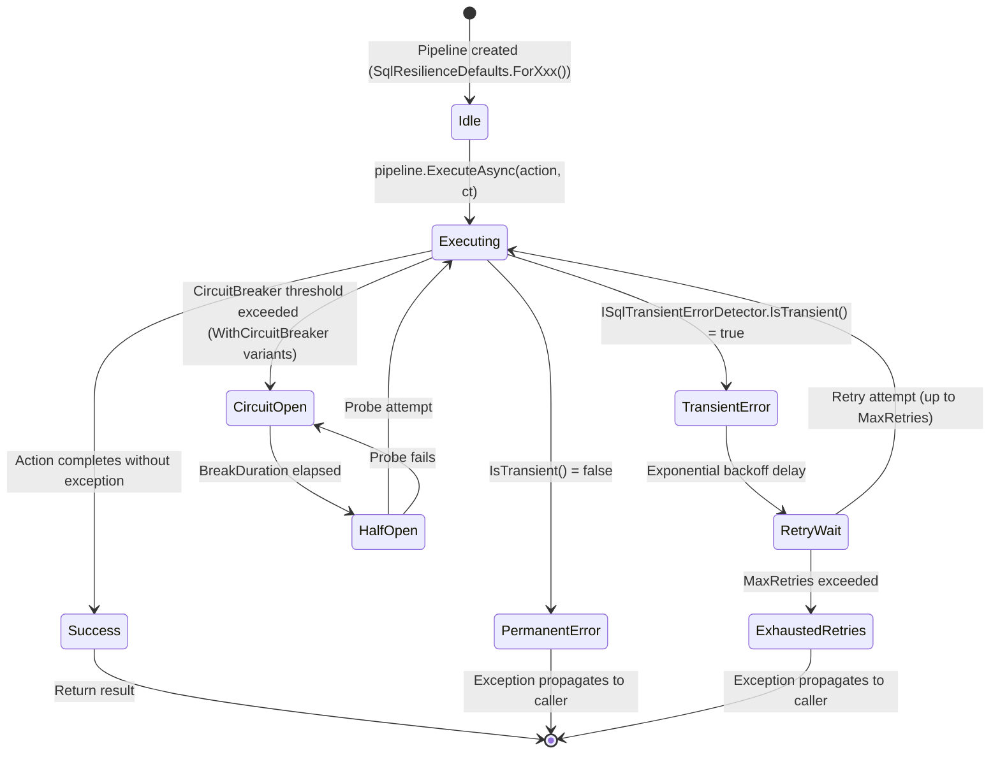
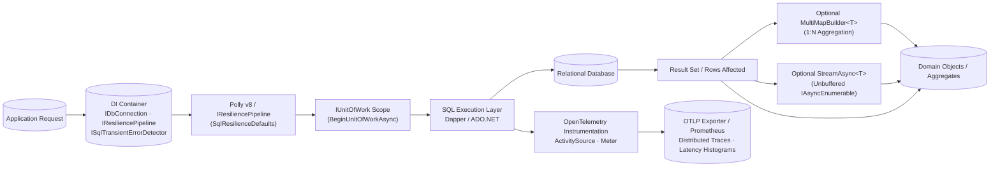

# Architecture & Functional Map — EricksonLopez.DapperExtensions

## 1. Overview & Architectural Philosophy

**EricksonLopez.DapperExtensions** is built on the philosophy of **"Raw SQL, Managed Infrastructure"**. It provides enterprise-grade transactional boundaries, transient fault resilience, dialect-native bulk throughput, and Native AOT zero-reflection hydration while giving developers 100% control over SQL text, query semantics, and database execution plans.



---

## 2. Layer Transitions & Execution Lifecycle

From the moment an application request arrives until the transaction commits and connection disposes, the system follows a strictly defined layer lifecycle:



---

## 3. Internal Project Dependency Graph

```mermaid
graph TD
    Core["EricksonLopez.DapperExtensions<br/>(Core Library)"]
    DI["EricksonLopez.DapperExtensions.DependencyInjection"]
    SG["EricksonLopez.DapperExtensions.SourceGenerators<br/>(Roslyn Analyzer — netstandard2.0)"]
    HC["EricksonLopez.DapperExtensions.HealthChecks"]
    OTel["EricksonLopez.DapperExtensions.OpenTelemetry"]
    
    PG["EricksonLopez.DapperExtensions.PostgreSql"]
    MSSQL["EricksonLopez.DapperExtensions.SqlServer"]
    MySQL["EricksonLopez.DapperExtensions.MySql"]
    MariaDB["EricksonLopez.DapperExtensions.MariaDb"]
    Oracle["EricksonLopez.DapperExtensions.Oracle"]
    Sqlite["EricksonLopez.DapperExtensions.Sqlite"]

    DI --> Core
    HC --> Core
    OTel --> Core
    
    PG --> Core
    MSSQL --> Core
    MySQL --> Core
    MariaDB --> Core
    Oracle --> Core
    Sqlite --> Core

    %% SourceGenerators is a Roslyn analyzer; consuming apps reference it alongside Core
    %% to enable [SqlEntity] compile-time ReadFromDataReader/GetMultiMapReaderFactory generation (ADR-013)
    %% Note: generates static methods on partial class, NOT IDataReaderMapper<T> implementations
    SG -.->|"consumes [SqlEntity] marker<br/>(compile-time only)"| Core
    
    Showcase["EricksonLopez.DapperExtensions.Showcase<br/>(Executable Samples)"]
    Showcase --> DI
    Showcase --> HC
    Showcase --> OTel
    Showcase --> PG
    Showcase --> MSSQL
    Showcase --> MySQL
    Showcase --> MariaDB
    Showcase --> Oracle
    Showcase --> Sqlite
```



---

## 4. External Ecosystem Dependencies (Cross-Repository)

The following packages are produced by upstream sibling repositories and consumed exclusively as **NuGet package references** (`PackageReference`) centrally managed via `Directory.Packages.props`:



| External Package | Source Repository | Purpose |
|---|---|---|
| `EricksonLopez.Pagination.Abstractions` | `dotnet-pagination` | `ICountedPagedList<T>`, `ICursorPagedList<T>`, `PaginationParameters`, `CursorParameters` contracts |
| `EricksonLopez.Pagination` | `dotnet-pagination` | Default `PagedList<T>` and `CursorPagedList<T>` implementations |
| `EricksonLopez.Resilience.Abstractions` | `dotnet-resilience` | Resilience pipeline abstractions |
| `EricksonLopez.Resilience.Polly` | `dotnet-resilience` | Polly v8 pipeline adapter implementation |
| `EricksonLopez.SqlBuilder.Abstractions` | `dotnet-sql-builder` | SQL building abstraction contracts used by the Core library |

> **Standalone Build**: Upstream ecosystem packages are resolved from NuGet feeds through Central Package Management (`Directory.Packages.props`). The repository builds standalone with zero local directory dependencies.

---

## 5. Architectural Decisions & Key Invariants

The architecture enforces core design invariants formalized through Architecture Decision Records:

1. **Dialect Segregation ([ADR-001](adr/adr-001-multi-provider-architecture-and-dialect-isolation.md))**: Each relational engine is isolated into its own package. No database driver bloat is forced onto consuming applications.
2. **Resilience Scope ([ADR-016](adr/adr-016-resilience-pipeline-scope-wrap-unit-of-work.md))**: Polly resilience pipelines must wrap the *entire* Unit of Work, never retrying individual ADO.NET commands inside an active transaction.
3. **Savepoint-Aware Retry ([ADR-014](adr/adr-014-savepoint-aware-resilience-retry.md))**: Partial failures within active transactions use named savepoints (`ISavepoint`) with dedicated rollback semantics to prevent transaction state poisoning.
4. **Zero Reflection in Hot Paths ([ADR-006](adr/adr-006-native-aot-and-trimming-compliance-enforcement.md), [ADR-013](adr/adr-013-source-generator-for-aot-datareader-mapper.md))**: Full Native AOT compatibility verified via trim analyzers (`EnableTrimAnalyzer=true`) and Roslyn Incremental Generators (`[SqlEntity]`).
5. **No Full ORM / Change Tracker Invariant ([REJECT-011](adr/reject-011-custom-expression-tree-interpreters-in-dapper.md))**: The library strictly avoids in-memory change tracking, dynamic LINQ trees, and artificial abstraction layers over raw SQL.
6. **Ecosystem Resilience Convergence ([ADR-017](adr/adr-017-ecosystem-convergence-resilience-and-uow-transaction-boundary.md))**: Standardized on `IResiliencePipeline` from `EricksonLopez.Resilience` as the canonical authority, while retaining Polly overloads for backward compatibility without `[Obsolete]`.
7. **Ecosystem Demarcation ([ADR-018](adr/adr-018-architectural-boundary-and-coexistence-with-sql-builder.md))**: Formalized the "ONE CAPABILITY → ONE OWNER" demarcation between `DapperExtensions` (data access runtime, UoW, UNNEST, streaming) and `SqlBuilder` (query AST compiler).
8. **Async Streaming ([ADR-019](adr/adr-019-async-streaming-dapper-streaming-extensions.md))**: Unbuffered `IAsyncEnumerable<T>` streaming with an $O(1)$ memory consumption profile for high-volume record streams.

---

## 6. Resilience Pipeline State Diagram



---

## 7. Error Handling Flow Diagram

```mermaid
flowchart TD
    Start([SQL Operation Attempted]) --> Wrap{Wrapped in<br/>ResiliencePipeline?}

    Wrap -- Yes --> Execute[Execute Action]
    Wrap -- No --> DirectExec[Direct ADO.NET Execute]
    DirectExec --> DirectFail[Exception propagates immediately]

    Execute --> Result{Success?}
    Result -- Yes --> Done([Return Result])

    Result -- No --> Detect{ISqlTransientErrorDetector<br/>.IsTransient?}
    Detect --> No → Permanent --> Fail([Propagate Exception])

    Detect --> Yes → Transient --> InTx{Inside open<br/>IUnitOfWork?}
    InTx -- No --> Retry[Retry with backoff]
    Retry --> Execute

    InTx -- Yes → DANGER --> Savepoint{Using<br/>ISavepoint?}
    Savepoint -- Yes --> RollbackSP[savepoint.RollbackAsync]
    RollbackSP --> RetryOp[Retry sub-operation in savepoint]
    RetryOp --> Execute

    Savepoint -- No → POISONED --> PoisonedTx[Transaction state POISONED<br/>Retry would fail with SQLSTATE 25P02]
    PoisonedTx --> ForceRollback[Force uow.RollbackAsync]
    ForceRollback --> Fail
```

---

## 8. Processing Pipeline Diagram


