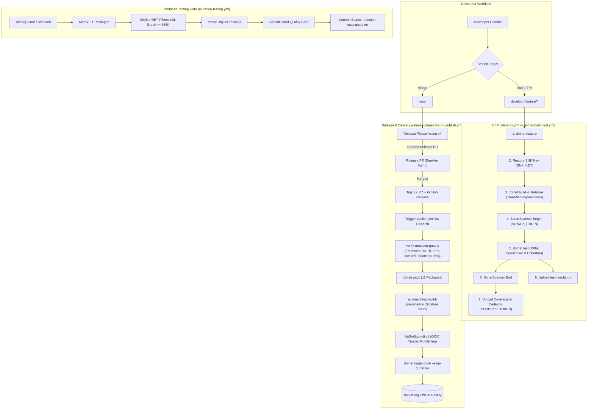

# CI/CD, Build & Quality Engineering — EricksonLopez.DapperExtensions

Comprehensive documentation of the build automation, continuous integration, continuous delivery (CI/CD), quality gates, and supply chain security infrastructure for **EricksonLopez.DapperExtensions**.

---

## 1. DevSecOps CI/CD Pipeline Architecture

---

## 2. GitHub Actions Workflows Breakdown

| Pipeline Name | Workflow File | Trigger | Primary Purpose |
|---|---|---|---|
| **Main CI** | `ci.yml` | `push`, `pull_request` (`main`, `develop`) | Fast PR feedback: builds, tests, coverage, NativeAOT smoke test |
| **Reusable Build & Test** | `dotnet-build-test.yml` | `workflow_call` | Build, test, coverage, SonarCloud analysis |
| **NativeAOT Smoke Test** | `aot-smoke-test.yml` | `push`/`PR`, `workflow_call`, `workflow_dispatch` | Publish & execute NativeAOT binary (`PublishAot=true`) |
| **Publish NuGet** | `publish.yml` | `push v*.*.*` tag, `workflow_dispatch` | Pack + Sigstore Attest + OIDC login + publish to NuGet.org |
| **Release Please** | `release-please.yml` | `push` (`main`) | Conventional Commits versioning, release PRs, dispatches publish |
| **Mutation Testing** | `mutation-testing.yml` | Schedule Mon 04:00 UTC, `workflow_dispatch` | 11-package Stryker mutation matrix & consolidated quality gate |
| **Benchmark Regression Gate** | `benchmark-regression-gate.yml` | `pull_request`, `workflow_dispatch` | Evaluates PR BenchmarkDotNet performance vs baseline (10% threshold) |
| **On-Demand Benchmarks** | `benchmarks.yml` | `workflow_call`, `workflow_dispatch` | Runs BenchmarkDotNet suite against containerized PostgreSQL |
| **Weekly Deep Benchmarks** | `weekly-benchmarks.yml` | Schedule Sun 02:00 UTC, `workflow_dispatch` | Cross-TFM (.NET 8/9/10) benchmark run committing baseline to `main` |
| **Repository Compliance** | `repo-compliance.yml` | `push`/`PR` (`main`), `workflow_dispatch` | Architecture, licensing, and compliance invariants verification |

---

### 1. `ci.yml` — Continuous Integration Orchestrator
- **File:** `.github/workflows/ci.yml`
- **Triggers:** `push` and `pull_request` on `main` and `develop` branches.
- **Jobs:**
  - `build-and-test`: Invokes `dotnet-build-test.yml`.
  - `aot-smoke-test`: Invokes `aot-smoke-test.yml`.
- **Secrets Forwarded:**
  - `SNK_KEY`: Base64-encoded Strong Name Key for assembly signing.
  - `CODECOV_TOKEN`: Codecov repository upload token.
  - `SONAR_TOKEN`: SonarCloud project analysis token.

---

### 2. `dotnet-build-test.yml` — Reusable Build & Test Workflow
- **File:** `.github/workflows/dotnet-build-test.yml`
- **Trigger:** `workflow_call`
- **Inputs:**
  - `dotnet-version`: .NET SDK version (default: `10.0.x`).
  - `test-filter`: Test filter expression (e.g. `Category!=Integration`).
  - `test-project`: Specific test project path (leave empty for all).
  - `upload-coverage`: Boolean flag to upload Codecov coverage (default: `true`).
  - `artifact-name`: Artifact name for test results (default: `test-results`).
- **Secrets:** `SNK_KEY`, `CODECOV_TOKEN`, `SONAR_TOKEN`.
- **Steps:**
  1. **Checkout**: Full Git history (`fetch-depth: 0`).
  2. **Setup .NET**: Installs .NET SDK `10.0.x`.
  3. **Restore Strong Name Key**: Decodes `SNK_KEY` to `EricksonLopez.snk` in the repository root (matched by `Directory.Build.props` `Exists()` conditional).
  4. **Setup Java & SonarScanner**: Installs OpenJDK 17 and `dotnet-sonarscanner`.
  5. **SonarCloud Begin**: Configures exclusions for tests/benchmarks/generators.
  6. **Build (Release)**: `dotnet build EricksonLopez.DapperExtensions.slnx --configuration Release`.
  7. **Run Tests**: `dotnet test` collecting OpenCover and Cobertura coverage.
  8. **SonarCloud End**: Finalizes static analysis scan.
  9. **Upload Artifacts**: Saves `test-results.trx` and uploads coverage to Codecov.

---

### 3. `aot-smoke-test.yml` — NativeAOT Compilation & Execution Gate
- **File:** `.github/workflows/aot-smoke-test.yml`
- **Triggers:** `workflow_call`, `push`/`pull_request` on `main`/`develop`, `workflow_dispatch`.
- **Prerequisites Installed:** `clang`, `lld`, `zlib1g-dev`.
- **Execution:**
  1. Compiles solution in Release mode.
  2. Publishes `tests/EricksonLopez.DapperExtensions.AotSmokeTest` with `--runtime linux-x64 --self-contained -p:PublishAot=true -p:TreatWarningsAsErrors=true`.
  3. Treats any trimmer warnings (`IL2026`, `IL3050`) as fatal compilation errors.
  4. Executes the native binary `./aot-output/EricksonLopez.DapperExtensions.AotSmokeTest` and verifies exit code 0.

---

### 4. `mutation-testing.yml` — Stryker.NET Mutation Testing Matrix
- **File:** `.github/workflows/mutation-testing.yml`
- **Triggers:** Weekly cron schedule (`0 4 * * 1` — Mondays at 04:00 UTC) and `workflow_dispatch` (choice: `Basic`, `Standard`, `Advanced`).
- **Matrix Strategy:** Executes parallel Stryker runs across all 11 packages:
  - `Core` (`stryker-config.json`)
  - `DependencyInjection` (`stryker-dependencyinjection-config.json`)
  - `HealthChecks` (`stryker-healthchecks-config.json`)
  - `MariaDb` (`stryker-mariadb-config.json`)
  - `MySql` (`stryker-mysql-config.json`)
  - `OpenTelemetry` (`stryker-opentelemetry-config.json`)
  - `Oracle` (`stryker-oracle-config.json`)
  - `PostgreSql` (`stryker-postgresql-config.json`)
  - `SourceGenerators` (`stryker-sourcegenerators-config.json`)
  - `Sqlite` (`stryker-sqlite-config.json`)
  - `SqlServer` (`stryker-sqlserver-config.json`)
- **Threshold Policy (Single Source of Truth in `stryker-*.json`):**
  - **High:** $\ge 100\%$ (✅ High)
  - **Low:** $\ge 98\%$ (🟡 Low)
  - **Warn:** $\ge 95\%$ (🟠 Warning)
  - **Break:** $< 95\%$ (❌ Failed / Pipeline Exit Error)
- **Consolidated Gate (`mutation-gate-summary`):**
  - Downloads all summary JSON files and calculates weighted overall mutation score.
  - Appends Markdown table to `$GITHUB_STEP_SUMMARY`.
  - Posts GitHub Commit Status `mutation-testing/stryker` on target commit SHA.

---

### 5. `publish.yml` — Automated NuGet Packaging & Distribution
- **File:** `.github/workflows/publish.yml`
- **Triggers:** Manual tag push (`v*.*.*`) or `workflow_dispatch` triggered by `release-please.yml`.
- **Permissions:**
  - `id-token: write` (Sigstore OIDC & NuGet login)
  - `contents: write` (GitHub Release creation)
  - `attestations: write` (`actions/attest-build-provenance`)
  - `statuses: read`, `actions: read` (Stryker gate verification)
- **Quality Gate (`scripts/verify-mutation-gate.js`):**
  - Validates recent Stryker run ($\le 7$ days).
  - Enforces zero production code drift in `src/` since last mutation run.
  - Enforces mutation score $\ge 95\%$ break threshold.
- **Publish Flow:**
  1. Executes full test suite with coverage upload.
  2. Packs all 11 packages with resolved SemVer (`-p:VersionPrefix=$VERSION`).
  3. Generates **Sigstore Build Provenance Attestation** via `actions/attest-build-provenance@v2`.
  4. Authenticates to NuGet.org via short-lived OIDC (`NuGet/login@v1`).
  5. Pushes `.nupkg` packages to NuGet.org with `--skip-duplicate`.
  6. Creates official GitHub Release with release package inventory table.

---

### 6. `release-please.yml` — Automated Versioning & Release PRs
- **File:** `.github/workflows/release-please.yml`
- **Triggers:** Push to `main` branch.
- **Engine:** Google Release Please Action v4 with Conventional Commits parser.
- **Automation:**
  - Parses commits (`feat:`, `fix:`, `perf:`, `chore:`).
  - Maintains `Directory.Build.props` `<VersionPrefix>` and `.release-please-manifest.json`.
  - Generates/updates Release PRs and creates GitHub release tags (`vX.Y.Z`).
  - Dispatches `publish.yml` via GitHub Actions REST API.

---

### 7. `benchmark-regression-gate.yml` — PR Performance Regression Check
- **File:** `.github/workflows/benchmark-regression-gate.yml`
- **Triggers:** Pull Request to `main` or `develop` touching `src/**` or `benchmarks/**`, and `workflow_dispatch`.
- **Inputs:** `threshold` (default: `10` for +10% regression limit).
- **Execution:**
  1. Runs BenchmarkDotNet suite on PR head.
  2. Compares mean execution times against baseline JSON files in `benchmarks/results/`.
  3. Fails CI if any benchmark regresses by more than `REGRESSION_THRESHOLD`%.
  4. Publishes Benchmark Regression Report to GitHub Step Summary.

---

### 8. `benchmarks.yml` — On-Demand Benchmark Suite
- **File:** `.github/workflows/benchmarks.yml`
- **Triggers:** `workflow_call`, `workflow_dispatch` (with `benchmark-filter` input).
- **Services:** `postgres:16-alpine` service container on port 5432.
- **Execution:** Runs `EricksonLopez.DapperExtensions.PostgreSql.Benchmarks` on .NET 10.0, exports JSON and Markdown results, and uploads artifacts.

---

### 9. `weekly-benchmarks.yml` — Weekly Deep Performance Review
- **File:** `.github/workflows/weekly-benchmarks.yml`
- **Triggers:** Scheduled cron (`0 2 * * 0` — Sundays at 02:00 UTC) and `workflow_dispatch`.
- **Services:** Containerized PostgreSQL 16 on port 5432.
- **Execution:**
  1. Runs deep BenchmarkDotNet review across all supported runtimes (`net8.0`, `net9.0`, `net10.0`).
  2. Syncs generated Markdown and JSON results into `benchmarks/results/`.
  3. Commits updated benchmark baseline directly to `main` (`[skip ci]`).

---

### 10. `repo-compliance.yml` — Repository Architecture & Rule Compliance
- **File:** `.github/workflows/repo-compliance.yml`
- **Triggers:** `push` and `pull_request` on `main`, `workflow_dispatch`.
- **Execution:**
  1. Runs `scripts/verify-compliance.ps1` to verify architecture boundaries, licensing headers, and code standards.
  2. Compiles with `TreatWarningsAsErrors=true` on .NET 10.0.
  3. Runs unit test suite (`FullyQualifiedName!~IntegrationTests`).
  4. Verifies packability of all packages into `./artifacts`.

---

## 3. Quality & Security Standards Summary

| Quality Gate | Tooling / Configuration | Threshold / Requirement |
|---|---|---|
| **Build Diagnostics** | MSBuild (`TreatWarningsAsErrors=true`, `WarningLevel=5`) | 0 Warnings allowed (Treated as build errors) |
| **Code Style** | `.editorconfig`, `EnforceCodeStyleInBuild=true` | Build failure on style or rule violation |
| **Code Coverage** | Coverlet XPlat, Cobertura, OpenCover, Codecov | Verified on every push and pull request |
| **Mutation Testing** | Stryker.NET (`dotnet-stryker`), Node.js evaluation | High: $100\%$, Low: $\ge 98\%$, Break: $\ge 95\%$ |
| **Static Analysis** | SonarCloud (`dotnet-sonarscanner`) | Strict Quality Gate passed on SonarCloud |
| **Dependency Auditing** | `NuGetAudit=true`, `NuGetAuditMode=all`, `NuGetAuditLevel=low` | Build fails on known vulnerable dependencies |
| **Assembly Signing** | Strong Name Key (`EricksonLopez.snk`) | Deterministic assembly signing on all assemblies |
| **Provenance Attestation** | Sigstore OIDC (`actions/attest-build-provenance`) | Cryptographic build provenance for all packages |
| **NuGet Authentication** | NuGet Trusted Publishing (OIDC via `NuGet/login@v1`) | Zero static API keys or long-lived secrets |
| **Benchmark Regression** | BenchmarkDotNet + Python comparator script | Max allowed performance regression: $\le 10\%$ |
| **Native AOT Safety** | `EnableTrimAnalyzer=true` + `aot-smoke-test.yml` | Zero trimmer warnings (`IL2026`, `IL3050`) allowed |
