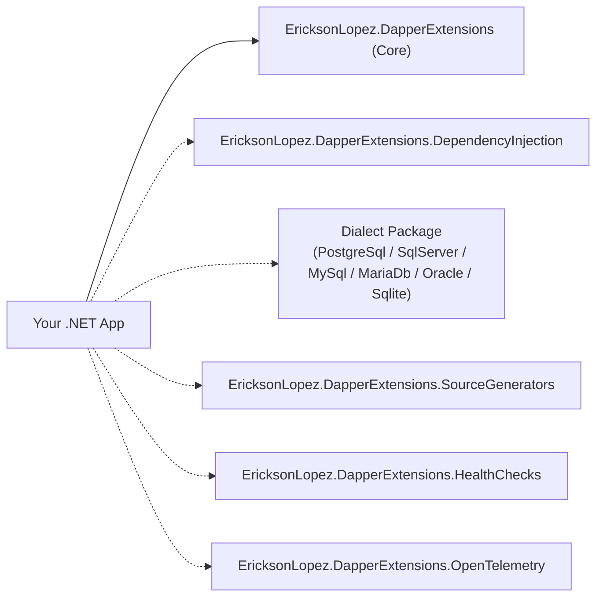

# Getting Started — EricksonLopez.DapperExtensions

A complete guide to adopting **EricksonLopez.DapperExtensions** in modern .NET 8, .NET 9, and .NET 10 applications.

---

## 1. Introduction

**EricksonLopez.DapperExtensions** addresses common enterprise infrastructure challenges in **Dapper** without introducing the overhead or loss of control associated with full ORMs:

- **Async Transaction Management**: First-class `IUnitOfWork` and nested `ISavepoint` support with deterministic async disposal.
- **Transient Error Resilience**: Polly v8 resilience pipelines tailored to dialect error codes (SQLSTATE, ORA codes).
- **High-Throughput Bulk Operations**: Dialect-native batching (PostgreSQL `UNNEST`, SQL Server `SqlBulkCopy`, parameter-bounded batch `VALUES`).
- **Relational Hydration**: Multi-entity mapping with key-based 1:N root deduplication.
- **Native AOT & Trimming**: Zero reflection in hot paths via Roslyn Incremental Generators.
- **Full Observability**: OpenTelemetry tracing & metrics + ASP.NET Core database health probes.

---

## 2. Choosing Packages

Install only the packages your application needs:



```bash
# Core library (Mandatory)
dotnet add package EricksonLopez.DapperExtensions

# Choose your database dialect (Mandatory for bulk/pagination/savepoints)
dotnet add package EricksonLopez.DapperExtensions.PostgreSql
# OR: EricksonLopez.DapperExtensions.SqlServer
# OR: EricksonLopez.DapperExtensions.MySql
# OR: EricksonLopez.DapperExtensions.MariaDb
# OR: EricksonLopez.DapperExtensions.Oracle
# OR: EricksonLopez.DapperExtensions.Sqlite

# Optional integrations
dotnet add package EricksonLopez.DapperExtensions.DependencyInjection
dotnet add package EricksonLopez.DapperExtensions.OpenTelemetry
dotnet add package EricksonLopez.DapperExtensions.HealthChecks
dotnet add package EricksonLopez.DapperExtensions.SourceGenerators
```

---

## 3. Configuration & Startup

### ASP.NET Core / Generic Host
```csharp
using System;
using EricksonLopez.DapperExtensions.DependencyInjection;
using EricksonLopez.DapperExtensions.HealthChecks;
using EricksonLopez.DapperExtensions.OpenTelemetry;
using Microsoft.AspNetCore.Builder;
using Microsoft.Extensions.DependencyInjection;

var builder = WebApplication.CreateBuilder(args);

// 1. Core DI registration (Type Handlers & Detectors)
builder.Services.AddDapperExtensions(options =>
{
    options.RegisterStandardTypeHandlers = true;   // DateOnly & TimeOnly
    options.RegisterTransientErrorDetectors = true; // Dialect error detectors
});

// 2. OpenTelemetry Tracing & Metrics
builder.Services.AddDapperOpenTelemetry(options =>
{
    options.CaptureSqlStatements = true;
    options.EnableMetrics = true;
    options.MaxStatementLength = 2048;
});

// 3. Database Health Checks
builder.Services.AddHealthChecks()
    .AddPostgreSqlDapperHealthCheck(
        name: "postgres-main",
        connectionFactory: async (sp, ct) => await ResolveConnectionAsync(sp, ct),
        configure: opt => opt.Timeout = TimeSpan.FromSeconds(3));
```

---

## 4. Fundamental Concepts

### 1. The `IUnitOfWork` Lifetime
```csharp
using System.Data;
using Dapper;
using EricksonLopez.DapperExtensions.UnitOfWork;

await using var uow = await connection.BeginUnitOfWorkAsync(IsolationLevel.ReadCommitted);
try
{
    await connection.ExecuteAsync(sql1, param1, uow.Transaction);
    await connection.ExecuteAsync(sql2, param2, uow.Transaction);
    await uow.CommitAsync();
}
catch
{
    // Auto-rollback occurs on disposal if not committed
    throw;
}
```

### 2. Multi-Map & 1:N Deduplication
```csharp
using EricksonLopez.DapperExtensions.MultiMap;

var orders = await MultiMapBuilder<Order>
    .Query(orderJoinQuery)
    .Map<OrderItem>("item_id", (order, item) =>
    {
        if (item != null) order.Items.Add(item);
        return order;
    })
    .QueryGroupedAsync(connection, compiler, o => o.Id);
```

---

## 5. Next Steps

- Check out the [Cookbook](cookbook.md) for complete recipes.
- Explore the [API Reference](api-reference.md) for full signatures.
- Review [Best Practices](best-practices.md) for architectural guidelines.
- Explore the [Showcase Documentation](showcase/README.md) for 11 progressive learning levels.
