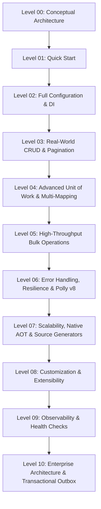

# Official Showcase Documentation — EricksonLopez.DapperExtensions

Welcome to the **Executable Reference Documentation** for `EricksonLopez.DapperExtensions`.

The Showcase project ([`samples/EricksonLopez.DapperExtensions.Showcase`](../../samples/EricksonLopez.DapperExtensions.Showcase)) represents the living, executable reference implementation of the entire public API across all supported target frameworks (`net8.0`, `net9.0`, `net10.0`) and Native AOT.

---

## 🎯 Pedagogical Progression Index



| Level | Guide | Focus Area | Executable Demo |
|---|---|---|---|
| **Level 00** | [**Conceptual**](level-00-conceptual.md) | Philosophy ("Raw SQL, Managed Infrastructure"), comparison with Dapper & EF Core, tradeoffs. | [`ConceptualOverview.cs`](../../samples/EricksonLopez.DapperExtensions.Showcase/Levels/Level00_Conceptual/ConceptualOverview.cs) |
| **Level 01** | [**Quick Start**](level-01-quickstart.md) | Minimal setup, `AddDapperExtensions`, `DateOnly`/`TimeOnly` handlers, first query. | [`QuickStartDemo.cs`](../../samples/EricksonLopez.DapperExtensions.Showcase/Levels/Level01_QuickStart/QuickStartDemo.cs) |
| **Level 02** | [**Full Configuration**](level-02-configuration.md) | `DapperExtensionsOptions`, string enums, dialect-specific JSON type handlers, DI options. | [`ConfigurationDemo.cs`](../../samples/EricksonLopez.DapperExtensions.Showcase/Levels/Level02_Configuration/ConfigurationDemo.cs) |
| **Level 03** | [**Real-World Use Cases**](level-03-real-world-use-cases.md) | Offset pagination (`QueryPagedAsync`), single round-trip (`QueryPagedMultipleAsync`), Keyset (`QueryCursorPagedAsync`). | [`PaginationAndCrudDemo.cs`](../../samples/EricksonLopez.DapperExtensions.Showcase/Levels/Level03_RealWorldUseCases/PaginationAndCrudDemo.cs) |
| **Level 04** | [**Advanced Integration**](level-04-advanced-integration.md) | `IUnitOfWork`, `WithUnitOfWorkAsync<TResult>`, nested `ISavepoint`, `MultiMapBuilder<TReturn>`. | [`UnitOfWorkAndMultiMapDemo.cs`](../../samples/EricksonLopez.DapperExtensions.Showcase/Levels/Level04_AdvancedIntegration/UnitOfWorkAndMultiMapDemo.cs) |
| **Level 05** | [**Bulk Processing**](level-05-bulk-processing.md) | PostgreSQL `UNNEST`, SQL Server `SqlBulkCopy`, SQLite/MySQL/Oracle batch builders. | [`BulkOperationsDemo.cs`](../../samples/EricksonLopez.DapperExtensions.Showcase/Levels/Level05_BulkProcessing/BulkOperationsDemo.cs) |
| **Level 06** | [**Error Handling & Resilience**](level-06-error-handling-and-resilience.md) | Polly v8 pipelines (`Standard`, `CircuitBreaker`, `Aggressive`, `Conservative`), ADR-016, savepoint retry (ADR-014). | [`ResilienceAndSavepointDemo.cs`](../../samples/EricksonLopez.DapperExtensions.Showcase/Levels/Level06_ErrorHandlingAndResilience/ResilienceAndSavepointDemo.cs) |
| **Level 07** | [**Scalability & Native AOT**](level-07-scalability-and-performance.md) | Strict Native AOT, `[SqlEntity]` Roslyn Source Generator, zero-reflection `IDataReaderMapper<T>`. | [`NativeAotAndPerformanceDemo.cs`](../../samples/EricksonLopez.DapperExtensions.Showcase/Levels/Level07_ScalabilityAndPerformance/NativeAotAndPerformanceDemo.cs) |
| **Level 08** | [**Customization**](level-08-customization.md) | Custom `ISqlTransientErrorDetector`, custom `MoneyTypeHandler`, custom AOT mappers. | [`CustomDetectorAndHandlerDemo.cs`](../../samples/EricksonLopez.DapperExtensions.Showcase/Levels/Level08_Customization/CustomDetectorAndHandlerDemo.cs) |
| **Level 09** | [**Observability & Health Checks**](level-09-observability-and-health.md) | OpenTelemetry distributed tracing (`ActivitySource`), metrics (`Meter`, `Histogram`, `Counters`), database probes (`DapperHealthCheck`). | [`OpenTelemetryAndHealthChecksDemo.cs`](../../samples/EricksonLopez.DapperExtensions.Showcase/Levels/Level09_ObservabilityAndHealth/OpenTelemetryAndHealthChecksDemo.cs) |
| **Level 10** | [**Enterprise Architecture**](level-10-enterprise-architecture.md) | Transactional Outbox pattern, domain repositories with `IUnitOfWork`, resilient sagas with savepoints. | [`EnterprisePatternsDemo.cs`](../../samples/EricksonLopez.DapperExtensions.Showcase/Levels/Level10_EnterpriseArchitecture/EnterprisePatternsDemo.cs) |

---

## 🚀 Running the Showcase

To run the complete interactive showcase:

```bash
# Execute all levels sequentially
dotnet run --project samples/EricksonLopez.DapperExtensions.Showcase/EricksonLopez.DapperExtensions.Showcase.csproj -f net8.0

# Execute a specific level (e.g. Level 6)
dotnet run --project samples/EricksonLopez.DapperExtensions.Showcase/EricksonLopez.DapperExtensions.Showcase.csproj -f net8.0 -- --level 6
```
