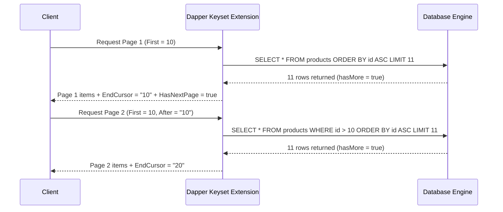

# Level 03: Real-World Use Cases (CRUD & Advanced Pagination)

## 1. Goal
Implement high-performance pagination patterns:
1. **Offset-based Pagination with Metadata** (`QueryPagedAsync`).
2. **Single Round-Trip Paginated Multi-Queries** (`QueryPagedMultipleAsync`).
3. **Cursor-based / Keyset Pagination** (`QueryCursorPagedAsync`) with forward and backward navigation.

---

## 2. Offset-Based Pagination with Metadata

Execute separate data and count queries returning an `ICountedPagedList<T>`:
```csharp
using EricksonLopez.DapperExtensions.Sqlite.Pagination; // Or PostgreSql, SqlServer, etc.
using EricksonLopez.Pagination;
using EricksonLopez.Pagination.Abstractions;

var paginationParams = PaginationParameters.Create(page: 1, pageSize: 10);

var pagedList = await connection.QueryPagedAsync<Product>(
    sql: "SELECT id, sku, name, price, stock_quantity AS StockQuantity, is_active AS IsActive, release_date AS ReleaseDate FROM products WHERE is_active = 1",
    countSql: "SELECT COUNT(*) FROM products WHERE is_active = 1",
    pagination: paginationParams);

Console.WriteLine($"Page {pagedList.Page} of {pagedList.TotalPages} (Total Items: {pagedList.TotalCount})");
Console.WriteLine($"Has Next Page: {pagedList.HasNextPage}");
```

---

## 3. Single Round-Trip Multi-Result Pagination
Combine the page query and total count in a single database round-trip via `QueryMultipleAsync`:
```csharp
const string multiPagedSql = """
    SELECT id, sku, name, price, stock_quantity AS StockQuantity, is_active AS IsActive, release_date AS ReleaseDate 
    FROM products 
    WHERE is_active = 1 
    LIMIT 10 OFFSET 0;

    SELECT COUNT(*) FROM products WHERE is_active = 1;
    """;

var multiPagedList = await connection.QueryPagedMultipleAsync<Product>(
    sql: multiPagedSql,
    pagination: paginationParams);

Console.WriteLine($"Fetched in 1 network round-trip. Total count: {multiPagedList.TotalCount}");
```

---

## 4. Keyset (Cursor-Based) Pagination
Keyset pagination avoids slow `OFFSET` scans over millions of rows by filtering on indexed primary keys:



### Initial Page Request
```csharp
var cursorParams = new CursorPaginationParameters
{
    First = 3
};

var cursorPagedList = await connection.QueryCursorPagedAsync<Product>(
    sql: "SELECT id, sku, name, price, stock_quantity AS StockQuantity FROM products",
    cursorColumn: "id",
    parameters: cursorParams,
    cursorSelector: p => p.Id.ToString(CultureInfo.InvariantCulture));

Console.WriteLine($"Items count: {cursorPagedList.Count}");
Console.WriteLine($"Start Cursor: {cursorPagedList.StartCursor}");
Console.WriteLine($"End Cursor: {cursorPagedList.EndCursor}");
Console.WriteLine($"Has Next Page: {cursorPagedList.HasNextPage}");
```

### Forward Navigation with `After`
```csharp
if (cursorPagedList.HasNextPage && cursorPagedList.EndCursor != null)
{
    var nextCursorParams = new CursorPaginationParameters
    {
        First = 3,
        After = cursorPagedList.EndCursor
    };

    var nextPageList = await connection.QueryCursorPagedAsync<Product>(
        sql: "SELECT id, sku, name, price, stock_quantity AS StockQuantity FROM products",
        cursorColumn: "id",
        parameters: nextCursorParams,
        cursorSelector: p => p.Id.ToString(CultureInfo.InvariantCulture));
}
```

---

## 5. Source Code Reference
- Executable Showcase: [`samples/EricksonLopez.DapperExtensions.Showcase/Levels/Level03_RealWorldUseCases/PaginationAndCrudDemo.cs`](../../samples/EricksonLopez.DapperExtensions.Showcase/Levels/Level03_RealWorldUseCases/PaginationAndCrudDemo.cs)
