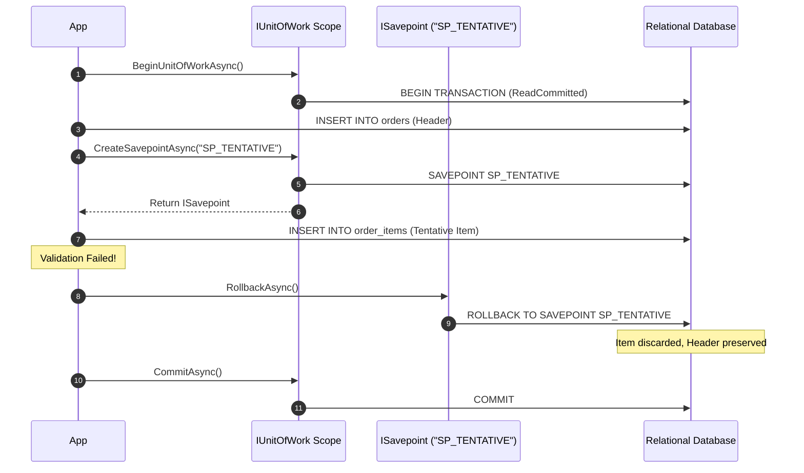

# Level 04: Advanced Integration (Unit of Work, Savepoints & Multi-Mapping)

## 1. Goal
Master asynchronous transaction management via `IUnitOfWork`, nested transaction savepoints (`ISavepoint`) for partial failure recovery, and fluent relational 1:N multi-mapping (`MultiMapBuilder<TReturn>`).

---

## 2. Functional Scoping with `WithUnitOfWorkAsync`
Executes an atomic operation inside a managed transaction scope. Commits on success and rolls back on failure:
```csharp
using EricksonLopez.DapperExtensions.UnitOfWork;

await connection.WithUnitOfWorkAsync(async (uow, ct) =>
{
    const string insertOrderSql = """
        INSERT INTO orders (customer_id, order_number, status, payment_method, total_amount, order_date)
        VALUES (1, 'ORD-UOW-001', 'Processing', 'CreditCard', 120.00, '2026-08-26');
        """;

    await connection.ExecuteAsync(insertOrderSql, transaction: uow.Transaction);

    const string insertItemSql = """
        INSERT INTO order_items (order_id, product_id, product_name, quantity, unit_price)
        VALUES (3, 1, 'Cloud Native Architecture Guide', 2, 60.00);
        """;

    await connection.ExecuteAsync(insertItemSql, transaction: uow.Transaction);
});
```

### Typed Result Variant: `WithUnitOfWorkAsync<TResult>`
```csharp
var orderCount = await connection.WithUnitOfWorkAsync<int>(async (uow, ct) =>
{
    return await connection.ExecuteScalarAsync<int>(
        "SELECT COUNT(*) FROM orders;",
        transaction: uow.Transaction);
});
```

---

## 3. Manual Unit of Work & Partial Rollback with Savepoints



### Code Example
```csharp
await using var uow = await connection.BeginUnitOfWorkAsync(IsolationLevel.ReadCommitted);

// 1. Insert header
const string insertHeaderSql = """
    INSERT INTO orders (customer_id, order_number, status, payment_method, total_amount, order_date)
    VALUES (2, 'ORD-SP-001', 'Draft', 'PayPal', 200.00, '2026-08-26');
    """;
await connection.ExecuteAsync(insertHeaderSql, transaction: uow.Transaction);

// 2. Create savepoint before tentative operation
var savepoint = await uow.CreateSavepointAsync("SP_TENTATIVE_ITEMS");

try
{
    // Tentative operation that might fail
    await ExecuteTentativeItemInsertionAsync(uow.Transaction);
    await savepoint.ReleaseAsync();
}
catch (Exception ex)
{
    // Partial rollback to savepoint only; outer transaction remains intact
    await savepoint.RollbackAsync();
}

// Commit the outer transaction
await uow.CommitAsync();
```

---

## 4. Fluent 1:N Multi-Mapping (`MultiMapBuilder<TReturn>`)

The `MultiMapBuilder<TReturn>` configures complex relational aggregate hydration:

```csharp
using EricksonLopez.DapperExtensions.MultiMap;

var builder = MultiMapBuilder<Order>.Query(query)
    .Map<OrderItem>(
        splitOn: "Id",
        combiner: (order, item) =>
        {
            if (item != null && item.Id > 0)
                order.Items.Add(item);
            return order;
        });

Console.WriteLine($"SplitOn: {builder.SplitOn}");
Console.WriteLine($"Root Type: {builder.Types[0].Name}");
Console.WriteLine($"Child Type: {builder.Types[1].Name}");
```

---

## 5. Source Code Reference
- Executable Showcase: [`samples/EricksonLopez.DapperExtensions.Showcase/Levels/Level04_AdvancedIntegration/UnitOfWorkAndMultiMapDemo.cs`](../../samples/EricksonLopez.DapperExtensions.Showcase/Levels/Level04_AdvancedIntegration/UnitOfWorkAndMultiMapDemo.cs)
