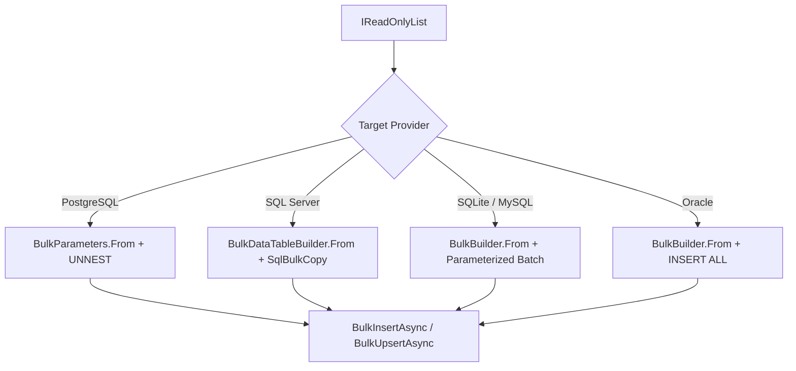

# Level 05: High-Throughput Bulk Processing

## 1. Goal
Execute high-performance bulk operations (`INSERT`, `UPSERT`, `UPDATE`, `DELETE`) tailored to each database engine's native capabilities.

---

## 2. Dialect Execution Matrix



---

## 3. SQLite, MySQL & MariaDB Multi-Row Parameterized Batching

```csharp
using EricksonLopez.DapperExtensions.Sqlite.Bulk;

var (sql, parameters) = BulkBuilder.From(bulkProducts)
    .Table("products")
    .Column("sku", p => p.Sku)
    .Column("name", p => p.Name)
    .Column("price", p => p.Price)
    .Column("stock_quantity", p => p.StockQuantity)
    .Column("is_active", p => p.IsActive ? 1 : 0)
    .Column("release_date", p => p.ReleaseDate.ToString("yyyy-MM-dd", CultureInfo.InvariantCulture))
    .Column("daily_restock_time", p => p.DailyRestockTime.ToString("HH:mm:ss", CultureInfo.InvariantCulture))
    .Column("metadata_json", p => p.MetadataJson)
    .Build();

var rowsInserted = await connection.BulkInsertAsync(sql, parameters);
```

### Upsert (INSERT OR REPLACE)
```csharp
var (upsertSql, upsertParams) = upsertBuilder.Build();
var sqlFinal = upsertSql.Replace("INSERT INTO", "INSERT OR REPLACE INTO", StringComparison.Ordinal);

var upsertRows = await connection.BulkUpsertAsync(sqlFinal, upsertParams);
```

---

## 4. PostgreSQL UNNEST Bulk Array Ingestion
PostgreSQL `UNNEST` provides 10–30x faster ingestion than standard multi-row inserts:

```csharp
using EricksonLopez.DapperExtensions.PostgreSql.Bulk;
using NpgsqlTypes;

var pgParams = BulkParameters.From(bulkProducts)
    .Add("Ids",        p => p.Id,            NpgsqlDbType.Bigint)
    .Add("Skus",       p => p.Sku,           NpgsqlDbType.Text)
    .Add("Names",      p => p.Name,          NpgsqlDbType.Text)
    .Add("Prices",     p => p.Price,         NpgsqlDbType.Numeric)
    .Add("StockQtys",  p => p.StockQuantity, NpgsqlDbType.Integer)
    .Build();

const string pgInsertSql = """
    INSERT INTO products (id, sku, name, price, stock_quantity)
    SELECT * FROM UNNEST(@Ids, @Skus, @Names, @Prices, @StockQtys);
    """;

await pgConnection.BulkInsertAsync(pgInsertSql, pgParams);
```

---

## 5. SQL Server `SqlBulkCopy` Streaming
```csharp
using EricksonLopez.DapperExtensions.SqlServer.Bulk;

var dataTable = BulkDataTableBuilder.From(bulkProducts)
    .Column("sku",            p => p.Sku)
    .Column("name",           p => p.Name)
    .Column("price",          p => p.Price)
    .Column("stock_quantity", p => p.StockQuantity)
    .Build();

await sqlServerConnection.BulkInsertAsync("dbo.products", dataTable, batchSize: 5000);
```

---

## 6. Source Code Reference
- Executable Showcase: [`samples/EricksonLopez.DapperExtensions.Showcase/Levels/Level05_BulkProcessing/BulkOperationsDemo.cs`](../../samples/EricksonLopez.DapperExtensions.Showcase/Levels/Level05_BulkProcessing/BulkOperationsDemo.cs)
