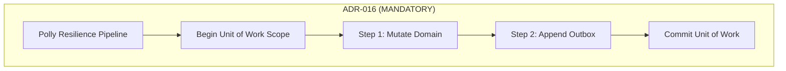

# Level 06: Error Handling & Resilience (Polly v8 & ADR-016)

## 1. Goal
Implement resilient database architectures using Polly v8 pipelines, provider-specific transient error detection via SQLSTATE / error codes, and strict transactional resilience boundaries (ADR-016 & ADR-014).

---

## 2. Core Architectural Principles



> [!IMPORTANT]
> **ADR-016 Mandate**: Always wrap the **entire transactional unit** (Begin → Execute → Commit) in the resilience pipeline. Never retry individual statements inside an open database transaction without savepoints.

> [!NOTE]
> **ADR-014 Exception**: When retrying an internal tentative operation inside an already open transaction, use `ExecuteInSavepointWithRetryAsync`. The failed operation is rolled back to the savepoint before each retry attempt.

---

## 3. Transient Error Detection

```csharp
using EricksonLopez.DapperExtensions.Resilience;

var sqliteDetector = SqliteTransientErrorDetector.Default;
var pgDetector = PostgreSqlTransientErrorDetector.Default;
var sqlServerDetector = SqlServerTransientErrorDetector.Default;
var oracleDetector = OracleTransientErrorDetector.Default;

bool isTransient = sqliteDetector.IsTransient(new InvalidOperationException("database is locked (SQLITE_BUSY)"));
// Returns true -> Eligible for retry
```

---

## 4. Pre-Configured Polly v8 Resilience Pipelines

```csharp
// Standard: 3 retries, exponential backoff (1s -> 2s -> 4s) + jitter, 30s timeout
var standardPipeline = SqlResilienceDefaults.ForPostgreSql();

// Circuit Breaker: Standard retry + circuit breaker (opens on 50% failures over 10s)
var cbPipeline = SqlResilienceDefaults.ForSqlServerWithCircuitBreaker();

// Aggressive: 5 retries (500ms -> 8s), 60s timeout
var aggressivePipeline = SqlResilienceDefaults.Aggressive(SqliteTransientErrorDetector.Default);

// Conservative: 1 retry after 5s constant wait, 120s timeout
var conservativePipeline = SqlResilienceDefaults.Conservative(SqliteTransientErrorDetector.Default);
```

---

## 5. Resilient Transaction Execution (ADR-016)

```csharp
var pipeline = SqlResilienceDefaults.ForSqlite();

await pipeline.ExecuteAsync(async ct =>
{
    await using var uow = await connection.BeginUnitOfWorkAsync(cancellationToken: ct);

    const string updateStockSql = "UPDATE products SET stock_quantity = stock_quantity - 1 WHERE id = 1;";
    await connection.ExecuteAsync(updateStockSql, transaction: uow.Transaction);

    await uow.CommitAsync(ct);
});
```

---

## 6. Retrying Inside Open Transactions with Savepoints (ADR-014)

```csharp
await using var uow = await connection.BeginUnitOfWorkAsync();

// Internal operation with savepoint-scoped retry
await uow.ExecuteInSavepointWithRetryAsync(
    pipeline,
    async (innerUow, ct) =>
    {
        const string insertAuditSql = """
            INSERT INTO outbox_messages (id, message_type, payload, status, created_at)
            VALUES ('MSG-001', 'OrderCreatedEvent', '{"orderId":1}', 'Pending', '2026-08-26');
            """;

        await connection.ExecuteAsync(insertAuditSql, transaction: innerUow.Transaction);
    },
    savepointName: "SP_AUDIT_RETRY");

await uow.CommitAsync();
```

### Typed Return Variant: `ExecuteInSavepointWithRetryAsync<TResult>`
```csharp
var stockCount = await uow.ExecuteInSavepointWithRetryAsync<int>(
    pipeline,
    async (innerUow, ct) =>
    {
        return await connection.ExecuteScalarAsync<int>(
            "SELECT stock_quantity FROM products WHERE id = 1;",
            transaction: innerUow.Transaction);
    },
    savepointName: "SP_TYPED_RETRY");
```

---

## 7. Direct Resilient Querying via `SqlResilienceExtensions` — All 6 Overloads

`SqlResilienceExtensions` exposes **6 query overloads**, each with distinct cardinality semantics:

| Method | Result Cardinality | Throws If |
|---|---|---|
| `QueryWithResilienceAsync<T>` | 0 .. N | — |
| `QueryFirstOrDefaultWithResilienceAsync<T>` | 0 .. 1 (first) | — |
| `QueryFirstWithResilienceAsync<T>` | 1 .. N (first) | 0 rows |
| `QuerySingleOrDefaultWithResilienceAsync<T>` | 0 .. 1 (exact) | > 1 rows |
| `QuerySingleWithResilienceAsync<T>` | exactly 1 | 0 rows or > 1 rows |
| `ExecuteScalarWithResilienceAsync<T>` | scalar | — |

```csharp
var pipeline = SqlResilienceDefaults.ForSqlite();

// QueryWithResilienceAsync<T> — 0..N rows
var products = await connection.QueryWithResilienceAsync<Product>(
    new SqlResult("SELECT id, sku, name, price, stock_quantity AS StockQuantity FROM products;",
                  new Dictionary<string, object?>()),
    pipeline);

// QueryFirstOrDefaultWithResilienceAsync<T> — first or null
var firstOrNull = await connection.QueryFirstOrDefaultWithResilienceAsync<Product>(
    new SqlResult("SELECT id, sku, name, price, stock_quantity AS StockQuantity FROM products WHERE id = @id;",
                  new Dictionary<string, object?> { ["id"] = 9999L }),
    pipeline);

// QueryFirstWithResilienceAsync<T> — first row; throws if 0 rows
var firstProduct = await connection.QueryFirstWithResilienceAsync<Product>(
    new SqlResult("SELECT id, sku, name, price, stock_quantity AS StockQuantity FROM products ORDER BY id ASC;",
                  new Dictionary<string, object?>()),
    pipeline);

// QuerySingleOrDefaultWithResilienceAsync<T> — null if not found; throws if > 1 row
var singleOrNull = await connection.QuerySingleOrDefaultWithResilienceAsync<Product>(
    new SqlResult("SELECT id, sku, name, price, stock_quantity AS StockQuantity FROM products WHERE id = @id;",
                  new Dictionary<string, object?> { ["id"] = 9999L }),
    pipeline);

// QuerySingleWithResilienceAsync<T> — exactly 1 row; throws if 0 or > 1
var exactlyOne = await connection.QuerySingleWithResilienceAsync<Product>(
    new SqlResult("SELECT id, sku, name, price, stock_quantity AS StockQuantity FROM products WHERE id = @id;",
                  new Dictionary<string, object?> { ["id"] = 1L }),
    pipeline);

// ExecuteScalarWithResilienceAsync<T> — scalar return
var count = await connection.ExecuteScalarWithResilienceAsync<int>(
    new SqlResult("SELECT COUNT(*) FROM products;", new Dictionary<string, object?>()),
    pipeline);
```

> [!TIP]
> Use `QuerySingleWithResilienceAsync` when the query MUST return exactly one row (e.g., PK lookup with a NOT NULL guarantee). If you're not sure whether a row exists, prefer `QuerySingleOrDefaultWithResilienceAsync` to avoid `InvalidOperationException`.

---

## 8. Source Code Reference
- Executable Showcase: [`samples/EricksonLopez.DapperExtensions.Showcase/Levels/Level06_ErrorHandlingAndResilience/ResilienceAndSavepointDemo.cs`](../../samples/EricksonLopez.DapperExtensions.Showcase/Levels/Level06_ErrorHandlingAndResilience/ResilienceAndSavepointDemo.cs)

