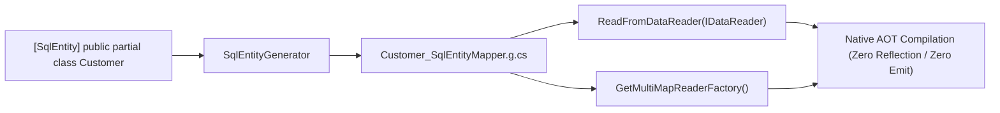

# Level 07: Scalability & Native AOT (Zero-Reflection)

## 1. Goal
Achieve maximum throughput and 100% Native AOT trimming compatibility using compile-time source-generated row mappers (`SqlEntityGenerator` & `[SqlEntity]`).

---

## 2. Compilation Architecture (Roslyn Incremental Generator)



---

## 3. Entity Decoration
Annotate domain entities with `[SqlEntity]` and declare them as `partial`:

```csharp
using EricksonLopez.DapperExtensions;

[SqlEntity(TableName = "customers")]
public sealed partial class Customer
{
    public long Id { get; set; }
    public string Email { get; set; } = string.Empty;
    public string FullName { get; set; } = string.Empty;
    public CustomerTier Tier { get; set; }
    public DateOnly RegisteredDate { get; set; }
}
```

---

## 4. Source-Generated Hydration

### Direct Reading from `IDataReader`
```csharp
using var command = connection.CreateCommand();
command.CommandText = "SELECT id, email, full_name AS FullName FROM customers WHERE id = 1;";
using var reader = await command.ExecuteReaderAsync();

if (reader.Read())
{
    // Generated at compile time: zero reflection, zero boxing, zero runtime IL emit
    var customer = Customer.ReadFromDataReader(reader);
    Console.WriteLine($"Hydrated: {customer.FullName} ({customer.Email})");
}
```

### MultiMap Factory Integration
```csharp
using EricksonLopez.DapperExtensions.MultiMap;

// Generated static factory method
var factory = Customer.GetMultiMapReaderFactory();

var descriptor = new MultiMapDescriptor(
    entityType: typeof(Customer),
    tableName: "customers",
    columnNames: ["id", "email", "full_name"],
    readerFactory: factory);
```

---

## 5. Performance Characteristics
- **Zero Reflection Overhead**: Directly reads columns by ordinal from the ADO.NET reader.
- **Zero IL Emission**: No `DynamicMethod` or `Reflection.Emit` calls, guaranteeing full Native AOT safety.
- **Microsecond Materialization**: In-memory throughput of 10,000+ objects in under 1ms.

---

## 6. Source Code Reference
- Executable Showcase: [`samples/EricksonLopez.DapperExtensions.Showcase/Levels/Level07_ScalabilityAndPerformance/NativeAotAndPerformanceDemo.cs`](../../samples/EricksonLopez.DapperExtensions.Showcase/Levels/Level07_ScalabilityAndPerformance/NativeAotAndPerformanceDemo.cs)
