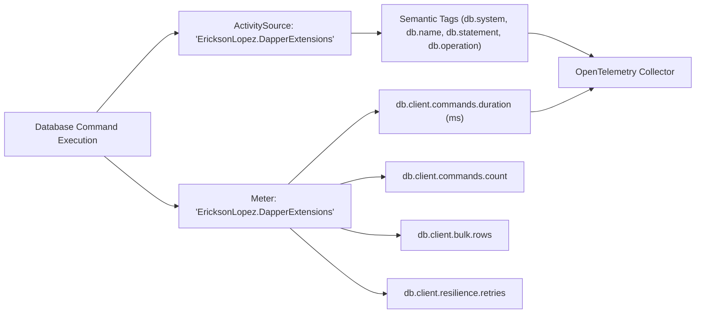

# Level 09: Observability & Health Checks

## 1. Goal
Integrate enterprise-grade distributed tracing and metrics via OpenTelemetry and configure database readiness/liveness health checks with latency thresholds.

---

## 2. OpenTelemetry Tracing & Metrics Architecture



---

## 3. Dependency Injection Configuration
```csharp
using EricksonLopez.DapperExtensions.OpenTelemetry;
using Microsoft.Extensions.DependencyInjection;

var services = new ServiceCollection();

services.AddDapperOpenTelemetry(options =>
{
    options.CaptureSqlStatements = true; // Include raw SQL in Activity tags
    options.EnableMetrics = true;        // Record duration histograms and counters
    options.MaxStatementLength = 2048;   // Truncate large statements to 2048 chars
});
```

---

## 4. Instrumented Execution Extensions

### Traced Query & Command
```csharp
using EricksonLopez.DapperExtensions.OpenTelemetry;

// Executes query inside an OpenTelemetry Activity with duration histogram recording
var products = await connection.QueryWithTelemetryAsync<Product>(
    sql: "SELECT id, sku, name, price, stock_quantity AS StockQuantity FROM products WHERE is_active = 1;");

// Executes command with affected rows tag and execution counter increment
var rowsAffected = await connection.ExecuteWithTelemetryAsync(
    sql: "UPDATE products SET price = price WHERE id = 1;");
```

### Traced Bulk Operation
```csharp
var rows = await connection.TraceBulkOperationAsync(
    operationName: "INSERT",
    targetTable: "products",
    bulkAction: async ct =>
    {
        return await connection.ExecuteAsync("INSERT INTO products ...", cancellationToken: ct);
    });
```

---

## 5. Database Health Checks

### Direct Health Probe Execution
```csharp
using EricksonLopez.DapperExtensions.HealthChecks;
using Microsoft.Extensions.Diagnostics.HealthChecks;

var probe = new DapperHealthCheck(
    connectionFactory: async ct => await OpenDatabaseConnectionAsync(),
    options: new DapperHealthCheckOptions
    {
        CommandText = "SELECT 1;",
        DegradedThreshold = TimeSpan.FromMilliseconds(200),
        Timeout = TimeSpan.FromSeconds(2)
    });

var result = await probe.CheckHealthAsync(new HealthCheckContext());
Console.WriteLine($"Status: {result.Status} ({result.Description})");
```

### Registration on `IHealthChecksBuilder`
```csharp
var services = new ServiceCollection();

services.AddHealthChecks()
    .AddPostgreSqlDapperHealthCheck(
        name: "postgres-main",
        connectionFactory: async (sp, ct) => await ResolvePgConnectionAsync(sp, ct))
    .AddSqlServerDapperHealthCheck(
        name: "sqlserver-replica",
        connectionFactory: async (sp, ct) => await ResolveSqlServerConnectionAsync(sp, ct))
    .AddOracleDapperHealthCheck(
        name: "oracle-erp", // Auto-configures 'SELECT 1 FROM DUAL'
        connectionFactory: async (sp, ct) => await ResolveOracleConnectionAsync(sp, ct))
    .AddMySqlDapperHealthCheck(
        name: "mysql-db",
        connectionFactory: async (sp, ct) => await ResolveMySqlConnectionAsync(sp, ct))
    .AddSqliteDapperHealthCheck(
        name: "sqlite-local",
        connectionFactory: async (sp, ct) => await ResolveSqliteConnectionAsync(sp, ct));
```

---

## 6. Source Code Reference
- Executable Showcase: [`samples/EricksonLopez.DapperExtensions.Showcase/Levels/Level09_ObservabilityAndHealth/OpenTelemetryAndHealthChecksDemo.cs`](../../samples/EricksonLopez.DapperExtensions.Showcase/Levels/Level09_ObservabilityAndHealth/OpenTelemetryAndHealthChecksDemo.cs)
