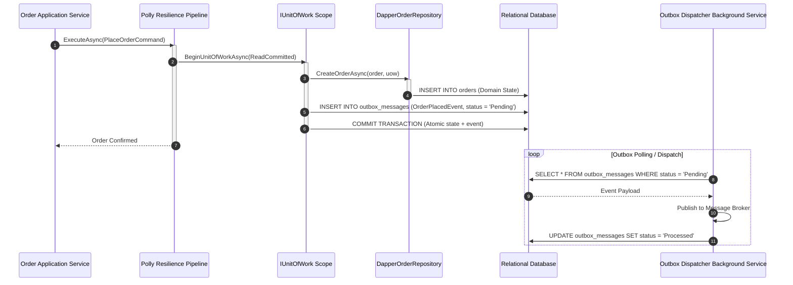

# Level 10: Enterprise Architecture & Transactional Outbox

## 1. Goal
Implement enterprise architectural patterns using `EricksonLopez.DapperExtensions`:
1. **Domain Repositories** integrated with `IUnitOfWork`.
2. **Transactional Outbox Pattern** ensuring dual-write atomicity between domain changes and integration events.
3. **Resilient Transaction Boundaries** adhering to ADR-016.

---

## 2. Transactional Outbox Architecture



---

## 3. Domain Repository Contract
```csharp
using EricksonLopez.DapperExtensions.UnitOfWork;

public interface IOrderRepository
{
    Task CreateOrderAsync(Order order, IUnitOfWork uow, CancellationToken ct = default);
    Task<Order?> GetOrderByIdAsync(long id, IDbConnection connection, IDbTransaction? transaction = null, CancellationToken ct = default);
}

public sealed class DapperOrderRepository : IOrderRepository
{
    public async Task CreateOrderAsync(Order order, IUnitOfWork uow, CancellationToken ct = default)
    {
        ArgumentNullException.ThrowIfNull(order);
        ArgumentNullException.ThrowIfNull(uow);

        const string sql = """
            INSERT INTO orders (customer_id, order_number, status, payment_method, total_amount, order_date)
            VALUES (@CustomerId, @OrderNumber, @Status, @PaymentMethod, @TotalAmount, @OrderDate);
            """;

        await uow.Transaction.Connection!.ExecuteAsync(new CommandDefinition(
            sql,
            new
            {
                order.CustomerId,
                order.OrderNumber,
                Status = order.Status.ToString(),
                PaymentMethod = order.PaymentMethod.ToString(),
                order.TotalAmount,
                OrderDate = order.OrderDate.ToString("yyyy-MM-dd", CultureInfo.InvariantCulture)
            },
            transaction: uow.Transaction,
            cancellationToken: ct));
    }

    public async Task<Order?> GetOrderByIdAsync(long id, IDbConnection connection, IDbTransaction? transaction = null, CancellationToken ct = default)
    {
        const string sql = "SELECT id, customer_id AS CustomerId, order_number AS OrderNumber, status AS Status, payment_method AS PaymentMethod, total_amount AS TotalAmount, order_date AS OrderDate FROM orders WHERE id = @Id;";
        return await connection.QuerySingleOrDefaultAsync<Order>(new CommandDefinition(sql, new { Id = id }, transaction: transaction, cancellationToken: ct));
    }
}
```

---

## 4. Atomic Outbox Enqueueing with Resilient Unit of Work
```csharp
var pipeline = SqlResilienceDefaults.ForSqlite();
var orderRepo = new DapperOrderRepository();

var newOrder = new Order
{
    CustomerId = 1,
    OrderNumber = "ORD-ENT-999",
    Status = OrderStatus.PendingPayment,
    PaymentMethod = PaymentMethod.CreditCard,
    TotalAmount = 249.99m,
    OrderDate = new DateOnly(2026, 8, 26)
};

// Wrap entire transaction in resilience pipeline (ADR-016)
await pipeline.ExecuteAsync(async ct =>
{
    await using var uow = await connection.BeginUnitOfWorkAsync(IsolationLevel.ReadCommitted, ct);

    // 1. Domain persistence
    await orderRepo.CreateOrderAsync(newOrder, uow, ct);

    // 2. Atomic Outbox message enqueueing
    const string outboxSql = """
        INSERT INTO outbox_messages (id, message_type, payload, status, created_at)
        VALUES (@Id, @MessageType, @Payload, 'Pending', @CreatedAt);
        """;

    var outboxMessage = new
    {
        Id = Guid.NewGuid().ToString(),
        MessageType = "OrderPlacedDomainEvent",
        Payload = "{\"orderNumber\":\"ORD-ENT-999\",\"amount\":249.99}",
        CreatedAt = DateTime.UtcNow.ToString("o", CultureInfo.InvariantCulture)
    };

    await connection.ExecuteAsync(new CommandDefinition(
        outboxSql,
        outboxMessage,
        transaction: uow.Transaction,
        cancellationToken: ct));

    // Commit both domain state and outbox event together
    await uow.CommitAsync(ct);
});
```

---

## 5. Outbox Processing Simulator
```csharp
const string pendingMessagesSql = "SELECT id, message_type AS MessageType, payload, status FROM outbox_messages WHERE status = 'Pending';";
var pendingMessages = await connection.QueryAsync(pendingMessagesSql);

foreach (var msg in pendingMessages)
{
    // Publish event to broker...
    
    // Mark as processed
    await connection.ExecuteAsync(
        "UPDATE outbox_messages SET status = 'Processed', processed_at = @ProcessedAt WHERE id = @Id;",
        new { Id = msg.id, ProcessedAt = DateTime.UtcNow.ToString("o") });
}
```

---

## 6. Source Code Reference
- Executable Showcase: [`samples/EricksonLopez.DapperExtensions.Showcase/Levels/Level10_EnterpriseArchitecture/EnterprisePatternsDemo.cs`](../../samples/EricksonLopez.DapperExtensions.Showcase/Levels/Level10_EnterpriseArchitecture/EnterprisePatternsDemo.cs)
