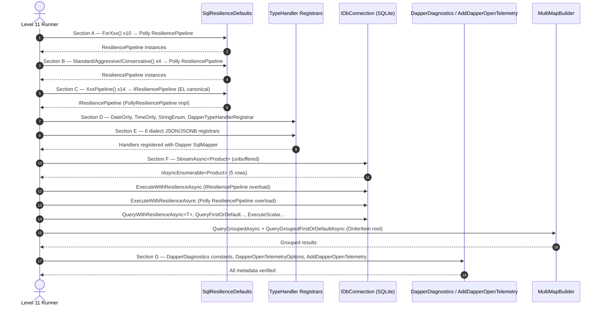

# Level 11: Comprehensive Public API Coverage Verification

## 1. Goal

Provide a living, executable verification harness that exercises **every public surface area** of all packages in the EricksonLopez.DapperExtensions ecosystem. This level serves as the canonical API coverage matrix — if an API is listed in the public inventory but does not appear here, it is a gap to be fixed.

**Coverage target (12 packages):**
- 28 `SqlResilienceDefaults` factory methods across two distinct pipeline families
- All 6 dialect JSON/JSONB TypeHandler registrars
- All 3 standard TypeHandlers (`DateOnly`, `TimeOnly`, `StringEnum`)
- `DapperStreamingExtensions.StreamAsync<T>`
- `SqlResilienceExtensions` — both Polly and EL canonical overloads
- `MultiMapBuilder<TReturn>` — `QueryGroupedAsync` and `QueryGroupedFirstOrDefaultAsync`
- `DapperDiagnostics` — all Meter instruments and semantic tag constants
- `DapperOpenTelemetryOptions` — all configuration properties
- `AddDapperOpenTelemetry` DI extension

---

## 2. Critical Design Distinction: Two Pipeline Families in `SqlResilienceDefaults`

> [!IMPORTANT]
> `SqlResilienceDefaults` exposes **two distinct families** of factory methods. Mixing them incorrectly causes type errors.

| Family | Suffix Pattern | Return Type | Use With |
|--------|---------------|-------------|----------|
| **Polly family** | No suffix (`ForSqlServer()`, `Standard()`, etc.) | `Polly.ResiliencePipeline` | `pipeline.ExecuteAsync()` or the Polly-overload of `SqlResilienceExtensions` |
| **EL canonical family** | `Pipeline` suffix (`ForSqlServerPipeline()`, `StandardPipeline()`, etc.) | `EricksonLopez.Resilience.IResiliencePipeline` | EL-canonical overloads of `SqlResilienceExtensions` (ADR-017) |

---

## 3. Verification Architecture



---

## 4. Section A & B: Polly `ResiliencePipeline` Family (14 methods)

```csharp
using EricksonLopez.DapperExtensions.Resilience;
using EricksonLopez.DapperExtensions.Sqlite.TypeHandlers;
using Polly;

// Section A: Provider shortcuts (10 methods)
ResiliencePipeline pollyForSqlServer    = SqlResilienceDefaults.ForSqlServer();
ResiliencePipeline pollyForSqlServerCb  = SqlResilienceDefaults.ForSqlServerWithCircuitBreaker();
ResiliencePipeline pollyForPostgreSql   = SqlResilienceDefaults.ForPostgreSql();
ResiliencePipeline pollyForPostgreSqlCb = SqlResilienceDefaults.ForPostgreSqlWithCircuitBreaker();
ResiliencePipeline pollyForMySql        = SqlResilienceDefaults.ForMySql();
ResiliencePipeline pollyForMySqlCb      = SqlResilienceDefaults.ForMySqlWithCircuitBreaker();
ResiliencePipeline pollyForSqlite       = SqlResilienceDefaults.ForSqlite();
ResiliencePipeline pollyForSqliteCb     = SqlResilienceDefaults.ForSqliteWithCircuitBreaker();
ResiliencePipeline pollyForOracle       = SqlResilienceDefaults.ForOracle();
ResiliencePipeline pollyForOracleCb     = SqlResilienceDefaults.ForOracleWithCircuitBreaker();

// Section B: Generic factories (4 methods)
var detector           = SqliteTransientErrorDetector.Default;
ResiliencePipeline pollyStandard   = SqlResilienceDefaults.Standard(detector);
ResiliencePipeline pollyStdCb      = SqlResilienceDefaults.StandardWithCircuitBreaker(detector);
ResiliencePipeline pollyAggressive = SqlResilienceDefaults.Aggressive(detector);
ResiliencePipeline pollyConserv    = SqlResilienceDefaults.Conservative(detector);
```

---

## 5. Section C: EL Canonical `IResiliencePipeline` Family (14 methods)

These return `EricksonLopez.Resilience.IResiliencePipeline` (ADR-017), which wraps the underlying Polly pipeline.

```csharp
using EricksonLopez.Resilience;

// Generic (4 methods)
IResiliencePipeline elStd   = SqlResilienceDefaults.StandardPipeline(detector);
IResiliencePipeline elStdCb = SqlResilienceDefaults.StandardWithCircuitBreakerPipeline(detector);
IResiliencePipeline elAgg   = SqlResilienceDefaults.AggressivePipeline(detector);
IResiliencePipeline elCons  = SqlResilienceDefaults.ConservativePipeline(detector);

// Provider shortcuts (10 methods)
IResiliencePipeline elSqlServer    = SqlResilienceDefaults.ForSqlServerPipeline();
IResiliencePipeline elSqlServerCb  = SqlResilienceDefaults.ForSqlServerWithCircuitBreakerPipeline();
IResiliencePipeline elPostgreSql   = SqlResilienceDefaults.ForPostgreSqlPipeline();
IResiliencePipeline elPostgreSqlCb = SqlResilienceDefaults.ForPostgreSqlWithCircuitBreakerPipeline();
IResiliencePipeline elMySql        = SqlResilienceDefaults.ForMySqlPipeline();
IResiliencePipeline elMySqlCb      = SqlResilienceDefaults.ForMySqlWithCircuitBreakerPipeline();
IResiliencePipeline elSqlite       = SqlResilienceDefaults.ForSqlitePipeline();
IResiliencePipeline elSqliteCb     = SqlResilienceDefaults.ForSqliteWithCircuitBreakerPipeline();
IResiliencePipeline elOracle       = SqlResilienceDefaults.ForOraclePipeline();
IResiliencePipeline elOracleCb     = SqlResilienceDefaults.ForOracleWithCircuitBreakerPipeline();
```

---

## 6. Section D: TypeHandlers

```csharp
using EricksonLopez.DapperExtensions.TypeHandlers;

// DateOnlyTypeHandler — SetValue and Parse
var param = new SqliteParameter();
DateOnlyTypeHandler.Default.SetValue(param, new DateOnly(2026, 9, 15));
DateOnly parsed = DateOnlyTypeHandler.Default.Parse(new DateTime(2026, 9, 15));

// TimeOnlyTypeHandler — SetValue and Parse
TimeOnlyTypeHandler.Default.SetValue(param, new TimeOnly(8, 30, 0));
TimeOnly parsedTime = TimeOnlyTypeHandler.Default.Parse(new DateTime(2026, 9, 15, 8, 30, 0));

// StringEnumTypeHandler
StringEnumTypeHandler<OrderStatus>.Default.SetValue(param, OrderStatus.Processing);
OrderStatus e = StringEnumTypeHandler<OrderStatus>.Default.Parse("Delivered");

// DapperTypeHandlerRegistrar
DapperTypeHandlerRegistrar.RegisterStandardHandlers();          // DateOnly + TimeOnly
DapperTypeHandlerRegistrar.RegisterStringEnumHandler<OrderStatus>();
DapperTypeHandlerRegistrar.RegisterStringEnumHandler<PaymentMethod>();
```

---

## 7. Section E: Dialect JSON/JSONB Registrars

```csharp
NpgsqlTypeHandlerRegistrar.RegisterJsonbHandler<ShowcaseJsonData>();     // PostgreSQL
SqlServerTypeHandlerRegistrar.RegisterJsonHandler<ShowcaseJsonData>();   // SQL Server
MySqlTypeHandlerRegistrar.RegisterJsonHandler<ShowcaseJsonData>();       // MySQL
MariaDbTypeHandlerRegistrar.RegisterJsonHandler<ShowcaseJsonData>();     // MariaDB
OracleTypeHandlerRegistrar.RegisterJsonHandler<ShowcaseJsonData>();      // Oracle
SqliteTypeHandlerRegistrar.RegisterJsonHandler<ShowcaseJsonData>();      // SQLite
```

---

## 8. Section F: Database Operations

```csharp
// StreamAsync<T> — unbuffered IAsyncEnumerable<T>
await foreach (var item in connection.StreamAsync<Product>("SELECT ... FROM products"))
{
    // O(1) memory profile regardless of result set size
}

// ExecuteWithResilienceAsync — EL canonical IResiliencePipeline overload (ADR-017)
var executeResult = new SqlResult("UPDATE products SET ...", new Dictionary<string, object?>());
int rowsEl = await connection.ExecuteWithResilienceAsync(executeResult, elSqlitePipeline);

// ExecuteWithResilienceAsync — Polly ResiliencePipeline overload
int rowsPolly = await connection.ExecuteWithResilienceAsync(executeResult, pollyForSqlite);

// QueryWithResilienceAsync<T> — EL canonical
var productsResult = new SqlResult("SELECT ... FROM products WHERE is_active = 1", new());
IEnumerable<Product> products = await connection.QueryWithResilienceAsync<Product>(productsResult, elSqlite);

// QueryFirstOrDefaultWithResilienceAsync<T> — EL canonical
var firstResult = new SqlResult("SELECT ... FROM products WHERE id = @id", new() { ["id"] = 1L });
Product? first = await connection.QueryFirstOrDefaultWithResilienceAsync<Product>(firstResult, elSqlite);

// ExecuteScalarWithResilienceAsync<T> — EL canonical
var countResult = new SqlResult("SELECT COUNT(*) FROM products", new());
int count = await connection.ExecuteScalarWithResilienceAsync<int>(countResult, elSqlite);

// MultiMapBuilder.QueryGroupedAsync — uses AOT source-generated ReadFromDataReader
// IMPORTANT: The root entity must have only natively convertible column types (no string-enum or DateOnly).
// OrderItem (long, string, int, decimal) is suitable; Order and Customer are not (they have string-mapped enums).
var multiMapQuery = new RawSqlQuery("SELECT ... FROM order_items", new());
var builder = MultiMapBuilder<OrderItem>.Query(multiMapQuery)
    .Map<OrderItem>("id", setter: (root, related) => { root.Quantity += related.Quantity; });

IEnumerable<OrderItem> grouped = await builder.QueryGroupedAsync(connection, compiler, i => i.OrderId);
OrderItem? first = await builder.QueryGroupedFirstOrDefaultAsync(connection, compiler, i => i.OrderId);
```

> [!WARNING]
> **AOT Reader Limitation**: `QueryGroupedAsync` and `QueryGroupedFirstOrDefaultAsync` use the source-generated `ReadFromDataReader` method, which performs `Convert.ChangeType` directly — bypassing registered Dapper `TypeHandlers`. Do not use entities with `DateOnly`, `TimeOnly`, or string-mapped enums as the root type for these methods. Use natively convertible types only (`long`, `int`, `string`, `decimal`, `bool`, `Guid`, `DateTime`).

---

## 9. Section G: OpenTelemetry API Surface

```csharp
using EricksonLopez.DapperExtensions.OpenTelemetry;

// DapperDiagnostics — constants and instruments
string source  = DapperDiagnostics.SourceName;    // "EricksonLopez.DapperExtensions"
string version = DapperDiagnostics.Version;        // "2.0.0"
ActivitySource actSource = DapperDiagnostics.ActivitySource;

// Meter instruments
string histName  = DapperDiagnostics.CommandDurationHistogram.Name;    // "db.client.commands.duration"
string execCount = DapperDiagnostics.CommandExecutionsCounter.Name;    // "db.client.commands.count"
string bulkRows  = DapperDiagnostics.BulkRowsCounter.Name;             // "db.client.bulk.rows"
string retries   = DapperDiagnostics.ResilienceRetriesCounter.Name;   // "db.client.resilience.retries"

// Semantic convention tag constants (OpenTelemetry Semantic Conventions)
string tagDbSystem      = DapperDiagnostics.TagDbSystem;        // "db.system"
string tagDbName        = DapperDiagnostics.TagDbName;          // "db.name"
string tagDbStatement   = DapperDiagnostics.TagDbStatement;     // "db.statement"
string tagDbOperation   = DapperDiagnostics.TagDbOperation;     // "db.operation"
string tagRowsAffected  = DapperDiagnostics.TagDbRowsAffected;  // "db.rows_affected"
string tagServerAddress = DapperDiagnostics.TagServerAddress;   // "server.address"
string tagErrorType     = DapperDiagnostics.TagErrorType;       // "error.type"

// DapperOpenTelemetryOptions — all configuration properties
var opts = new DapperOpenTelemetryOptions();
bool captureSQL    = opts.CaptureSqlStatements;  // default: true
bool enableMetrics = opts.EnableMetrics;         // default: true
int maxLen         = opts.MaxStatementLength;    // default: 4096

// AddDapperOpenTelemetry — DI registration
services.AddDapperOpenTelemetry(opt =>
{
    opt.CaptureSqlStatements = true;
    opt.EnableMetrics = true;
    opt.MaxStatementLength = 2048;
});
```

---

## 10. Living Code Reference

See full runnable implementation in [`Level11_ComprehensiveApiCoverageDemo.cs`](../../samples/EricksonLopez.DapperExtensions.Showcase/Levels/Level11_ComprehensiveApiCoverage/Level11_ComprehensiveApiCoverageDemo.cs).
