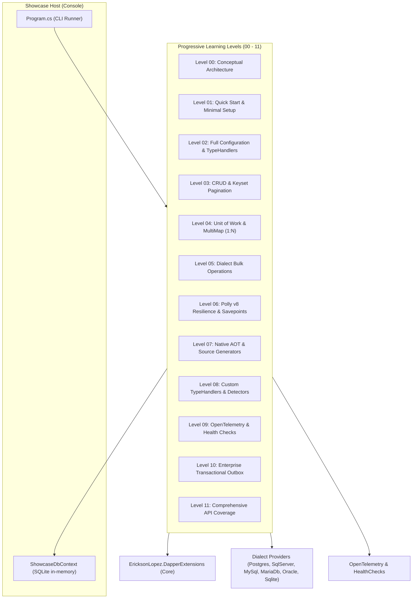

# EricksonLopez.DapperExtensions Showcase

The **official living reference implementation** and executable documentation for the [`EricksonLopez.DapperExtensions`](../../src/EricksonLopez.DapperExtensions) ecosystem.

---

## 🎯 Purpose & Philosophy

The Showcase represents the **executable specification** of the library's public API. Every feature, overload, extension method, resilience pipeline, type handler, and bulk builder supported by the library is demonstrated with working, runnable code against an in-memory SQLite database and simulated dialect configurations.

- **Zero Hypothetical APIs**: Every single class, method, and signature demonstrated exists in the production assemblies.
- **Pedagogical Progression**: Concepts are introduced progressively from conceptual foundations (Level 00) to enterprise-grade transactional outbox and saga workflows (Level 10) and full API verification (Level 11).
- **Executable & Self-Contained**: Can be executed via `dotnet run` without external infrastructure dependencies.

---

## 🏗️ Architectural Overview



---

## 🚀 Getting Started & Execution

### Prerequisites
- [.NET 8.0 SDK](https://dotnet.microsoft.com/download/dotnet/8.0) or higher (.NET 9 / 10 supported)

### Run All Levels
To run the complete interactive showcase through all 12 levels sequentially:

```bash
dotnet run --project samples/EricksonLopez.DapperExtensions.Showcase/EricksonLopez.DapperExtensions.Showcase.csproj -f net8.0
```

### Run a Specific Level
Use the `--level` (or `-l`) argument to execute a single level:

```bash
# Run Level 6 (Resilience & Savepoint Retries)
dotnet run --project samples/EricksonLopez.DapperExtensions.Showcase/EricksonLopez.DapperExtensions.Showcase.csproj -f net8.0 -- --level 6

# Run Level 11 (Comprehensive API Verification)
dotnet run --project samples/EricksonLopez.DapperExtensions.Showcase/EricksonLopez.DapperExtensions.Showcase.csproj -f net8.0 -- --level 11
```

---

## 📚 Level Index & Curriculum

| Level | Topic | Description | Source File |
|:---:|---|---|---|
| **00** | **Conceptual** | Philosophy ("Raw SQL, Managed Infrastructure"), comparison with Dapper & EF Core, tradeoffs. | [`ConceptualOverview.cs`](Levels/Level00_Conceptual/ConceptualOverview.cs) |
| **01** | **Quick Start** | Minimal setup, `AddDapperExtensions`, `DateOnly`/`TimeOnly` handlers, initial queries. | [`QuickStartDemo.cs`](Levels/Level01_QuickStart/QuickStartDemo.cs) |
| **02** | **Configuration** | `DapperExtensionsOptions`, string enums, dialect-specific JSON type handlers, DI options. | [`ConfigurationDemo.cs`](Levels/Level02_Configuration/ConfigurationDemo.cs) |
| **03** | **Real-World CRUD** | Offset pagination (`QueryPagedAsync`), single round-trip (`QueryPagedMultipleAsync`), Keyset (`QueryCursorPagedAsync`). | [`PaginationAndCrudDemo.cs`](Levels/Level03_RealWorldUseCases/PaginationAndCrudDemo.cs) |
| **04** | **Advanced Integration** | `IUnitOfWork`, `WithUnitOfWorkAsync<TResult>`, nested `ISavepoint`, `MultiMapBuilder<TReturn>`. | [`UnitOfWorkAndMultiMapDemo.cs`](Levels/Level04_AdvancedIntegration/UnitOfWorkAndMultiMapDemo.cs) |
| **05** | **Bulk Processing** | PostgreSQL `UNNEST`, SQL Server `SqlBulkCopy`, SQLite/MySQL/Oracle batch builders. | [`BulkOperationsDemo.cs`](Levels/Level05_BulkProcessing/BulkOperationsDemo.cs) |
| **06** | **Resilience & Faults** | Polly v8 pipelines (`Standard`, `CircuitBreaker`, `Aggressive`, `Conservative`), ADR-016, savepoint retry (ADR-014). | [`ResilienceAndSavepointDemo.cs`](Levels/Level06_ErrorHandlingAndResilience/ResilienceAndSavepointDemo.cs) |
| **07** | **Scalability & Native AOT** | Strict Native AOT, `[SqlEntity]` Roslyn Source Generator, zero-reflection `IDataReaderMapper<T>`. | [`NativeAotAndPerformanceDemo.cs`](Levels/Level07_ScalabilityAndPerformance/NativeAotAndPerformanceDemo.cs) |
| **08** | **Customization** | Custom `ISqlTransientErrorDetector`, custom `MoneyTypeHandler`, custom AOT mappers. | [`CustomDetectorAndHandlerDemo.cs`](Levels/Level08_Customization/CustomDetectorAndHandlerDemo.cs) |
| **09** | **Observability** | OpenTelemetry distributed tracing (`ActivitySource`), metrics (`Meter`, `Histogram`, `Counters`), database probes (`DapperHealthCheck`). | [`OpenTelemetryAndHealthChecksDemo.cs`](Levels/Level09_ObservabilityAndHealth/OpenTelemetryAndHealthChecksDemo.cs) |
| **10** | **Enterprise Architecture** | Transactional Outbox pattern, domain repositories with `IUnitOfWork`, resilient sagas with savepoints. | [`EnterprisePatternsDemo.cs`](Levels/Level10_EnterpriseArchitecture/EnterprisePatternsDemo.cs) |
| **11** | **API Coverage Verification** | Systematic execution of all 14 resilience factory methods, all 6 dialect JSON type handler registrars, standard handlers, and streaming. | [`Level11_ComprehensiveApiCoverageDemo.cs`](Levels/Level11_ComprehensiveApiCoverage/Level11_ComprehensiveApiCoverageDemo.cs) |

---

## 🛡️ Quality & Verification Invariants

1. **Compilability**: The Showcase project builds under `TreatWarningsAsErrors=true`.
2. **Deterministic Output**: All samples seed predictable schema and dataset states in SQLite.
3. **Official Documentation Alignment**: Every level maps directly to a companion document under [`docs/showcase/`](../../docs/showcase/).
